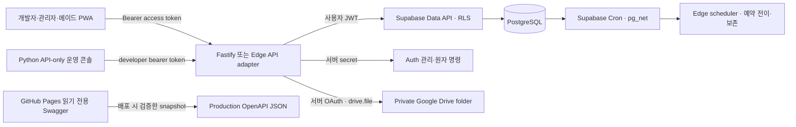
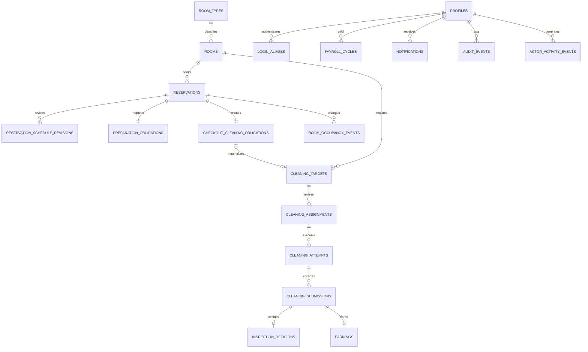

# 백엔드 서버 설계

> 문서 지위: 설계 검토 초안이다. 구현 전에 [백엔드 AI 제품·도메인 가이드](./AI_BACKEND_PRODUCT_GUIDE.md)를 먼저 읽는다. 이 문서와 ERD/DBML은 제품 가이드와 reconcile되기 전에는 목표 계약이 아니며, `[미확정]` 정책을 기존 코드나 이 문서만으로 확정하지 않는다.

## 기술 선택

- 개발 기준 API: Node.js 22, Fastify 5, TypeScript
- production PoC: Supabase Edge Functions(Deno 2) + Supabase Cron
- 데이터·인증: Supabase Auth, PostgreSQL 17
- 사진 파일: Google Drive API, 전용 비공개 폴더
- 입력 검증: Zod
- API 계약: OpenAPI 3.1 + 로컬 pinned Swagger UI + GitHub Pages 읽기 전용 운영 snapshot + [프론트·Codex 연동 가이드](./FRONTEND_API_INTEGRATION.md)
- 테스트: Vitest, Fastify injection, Deno Edge type check
- 배포 후보: 운영 Supabase의 Edge Functions·Cron + Supabase 복구검증 프로젝트

Fastify는 현재 개발 기준선이며 Edge PoC가 실패할 때의 rollback 경로다. 월 `$0` 운영을 위해 Issue #36에서 HTTP adapter만 Edge Functions로 교체할 수 있는지 검증한다. 핵심 정합성은 어느 adapter에서도 API 메모리가 아니라 PostgreSQL 제약과 트랜잭션에 둔다.

## 신뢰 경계

- 브라우저에는 publishable key만 허용합니다.
- secret/service-role 키는 서버에서만 사용하고 로그에 남기지 않습니다.
- 조회는 가능한 한 사용자 JWT와 RLS를 통과시킵니다.
- 계정 생성·비밀번호 초기화·여러 원장을 함께 바꾸는 명령만 서버 secret과 DB 함수를 사용합니다.
- Google Drive access/refresh token은 서버 secret으로만 보관하며 브라우저는 Drive에 직접 접근하지 않습니다.
- GitHub Pages에는 production OpenAPI snapshot과 정적 UI만 배포합니다. token 입력과 API 실행을 비활성화하고 service-role key나 repository secret을 artifact에 포함하지 않습니다.

developer 운영 상태는 `private` 원본이나 Supabase 내부 schema를 Edge에서 직접 직렬화하지 않습니다. DB catalog·Cron·감사 원장은 developer role을 다시 검증하는 app-owned `SECURITY DEFINER` projection을 거치고, Edge는 camelCase 응답과 안정적인 error code만 공개합니다. runtime secret은 소스 allowlist의 `configured` boolean만 반환하며 값·길이·해시·부분문자열은 반환하지 않습니다. Python 운영도구 연동은 [developer 운영 API 가이드](./DEVELOPER_OPERATIONS_API.md)를 따른다.

## 인증

1. 서버가 먼저 불변 profile UUID를 만들고, 관리자가 그 ID로 Supabase Auth 사용자를 생성합니다.
2. 내부 이메일은 `user-{profile_id}@auth.castletheart.invalid` 형식으로 서버만 계산합니다.
3. 사용자가 이름형 `loginId`와 최초 휴대전화 끝 4자리 임시 비밀번호 또는 허용된 개인 비밀번호를 보냅니다. 개인 비밀번호는 숫자 6~72자리 또는 10~72자의 영문 대·소문자·숫자·특수문자 조합이며, 4자리 임시값은 서버 내부에서만 Supabase 최소 길이를 만족하는 namespace 값으로 변환합니다.
4. 서버가 활성 alias와 프로필을 찾고 5회 실패/15분 잠금을 검사합니다.
5. 서버가 Supabase Auth password 로그인을 수행해 access/refresh token을 반환합니다.
6. 이후 API는 `auth.getUser(accessToken)`과 `auth.sessions`의 `session_id`를 검증하고 최신 프로필 역할·상태를 다시 읽습니다.

권한은 사용자 수정 가능한 `user_metadata`에 의존하지 않습니다. 역할 변경과 비활성화가 JWT 갱신 전에도 반영되도록 DB 프로필을 매 요청 확인합니다.

Edge 로그인은 alias 조회 전에 PostgreSQL fixed-window 제한을 **Supabase gateway가 확인한 client HMAC bucket(30회/분) → 정규화 ID별 HMAC bucket(10회/분) → 높은 emergency global bucket(600회/분)** 순서로 원자적으로 소비합니다. 공격 client가 ID를 계속 바꿔도 자기 bucket만 소진하며 다른 정상 client의 로그인을 막지 못합니다. global cap은 여러 client를 동원한 비상 상황의 최종 안전장치입니다. 원문 IP와 로그인 ID는 저장하지 않고, 첫 차단을 기록한 `limit + 1` 이후 같은 window의 추가 거부는 saturated row를 갱신하지 않습니다. 만료 row 정리도 요청당 최대 64개만 수행합니다. Edge instance 메모리는 cold start와 수평 확장 때 공유되지 않으므로 보안 제한 상태를 두지 않습니다. 사용자별 5회 실패/15분 잠금은 이 abuse 제한과 별도로 유지합니다.

성공한 업무 상태 변경은 `public.audit_events`에 immutable domain audit로 남깁니다. 로그인 성공·알려진 계정 로그인 실패·실제 민감정보 조회는 별도의 `private.actor_activity_events`에 개별 기록합니다. 알 수 없는 로그인 ID 실패는 ID/IP/HMAC 없이 분 단위 aggregate로, 인증된 actor의 중요 capability 거부는 `(actor, source, reason, UTC minute)` 단위 aggregate로 집계하며 count는 600에서 포화됩니다. activity 원장에 영구 저장되는 `request_id`는 Edge가 직접 생성한 UUID v4만 허용하고 caller의 `X-Request-ID`는 응답 correlation에만 transient하게 사용합니다. 모든 private 원본은 Data API에 노출하지 않고 fixed `search_path`와 exact server-only grant를 가진 app-owned RPC를 통해서만 append/projection합니다.

## 데이터 모델

색상이나 `투숙 중/청소 필요/배정 가능/배정 불가` 같은 복합 UI 상태는 저장하지 않습니다. 예약·수동 점유 보정·운영 중지·청소 단계·촛불·차단 이슈에서 파생합니다.

## 동시성과 멱등성

| 작업 | 서버 보장 |
|---|---|
| 계정 명령 | `(actor_profile_id, command_type, idempotency_key)` receipt + canonical request hash. 같은 scope·같은 payload는 동일 결과를 재생하고, 같은 scope·다른 payload는 거부하며, 서로 다른 actor/command의 동일 raw key는 충돌하지 않음. 동시 계정 생성에서 DB winner 외 Auth 사용자는 보상 삭제 |
| 객실·예약 명령 | actor 최신 상태·admin 역할 + 객실 `state_version`/예약 `version` CAS + actor/명령별 idempotency key + 짧은 전역 advisory lock으로 lock 순서 고정 |
| 예약 저장 | KST 기준 최소 1박·분 단위 + `[check_in_at, check_out_at)` `tstzrange` GiST exclusion으로 겹침 차단 |
| 입·퇴실 전이 | 고유 event key + 예약 lock으로 예정/수동 전이 중복 차단. 한 batch에서는 퇴실을 먼저 닫아 같은 instant의 다음 입실을 지연시키지 않고, worker 중단 중 완전히 지난 미입실 예약도 가짜 check-in 없이 checkout으로 catch-up |
| 주간 가능일 | 일요일 12:00–23:59 KST + 메이드/주차 current version CAS + canonical request hash |
| 마감 후 가능일 변경 | pending 요청 1건 + 관리자 결정 row lock + 승인 때만 새 immutable version |
| 청소 요청 | 예약·객실·checkout obligation·target을 양방향 복합키로 고정하고 동일 obligation을 한 번만 materialize. 연박/추가 수동 요청은 점유·접근 구간과 겹침을 검증한 안정적인 target ID 및 CAS soft cancel |
| 입실 준비 증명 | preparation obligation의 current attempt와 approved submission을 같은 수행으로 묶고, target 접근 가능 시각 이후 `attempt 시작 → 현장 완료 → 종료 → 제출 → 승인` 순서가 직전 점유 종료 이후부터 해당 체크인 이전까지 같은 객실에서 완결된 경우만 `approved` 허용. submission 소비 원장은 append-only·전역 unique라 다른 예약에 재사용할 수 없음 |
| PIN lease | 객실·예약·target·현재 assignment·현재 attempt·담당 메이드·최신 verified PIN version을 한 계약으로 묶음. 수동 checkout은 stale lease를 폐기하고 현재 verified version으로 현재 미공개 lease 한 건만 새 revision으로 재발급 |
| 담당 변경 | 대상 `assignment_version` CAS + 현재 담당 partial unique |
| 미통보 draft 배정 | target row lock + immutable assignment revision + 현재 `(maid, service_date, sequence)` partial unique. 저장 시 target 날짜·접근 가능·마감 시각 snapshot 고정 |
| 배정 알림 확정 | 서비스 날짜 global lock + target/assignment row lock + maid/week availability advisory lock + impact fingerprint + assignment/availability version CAS. 선택 부분집합 전체를 한 transaction으로 notification/outbox/audit와 함께 확정 |
| 청소 시작 | 메이드별 `in_progress` partial unique |
| 제출 | `client_submission_id` unique + 회차별 현재 제출 unique |
| 검수 | 제출별 decision unique, 현재 `submitted` 버전만 조건부 전이 |
| 수익 | submission/entitlement unique |
| 지급 | `(maid_profile_id, week_start)` unique + earning의 `earned_on` 주차 일치 + `payroll_items.earning_id` exclusive claim + PAYING 이후 snapshot 불변 + 미송금 사유 기록 reopen + version CAS |
| 알림 | 수신자별 dedupe key unique, 10분 group key |

복수 테이블을 바꾸는 예약 저장·변경·취소·체크아웃과 배정 알림 확정은 SQL RPC의 짧은 transaction으로 원장, projection, 감사 이벤트를 함께 커밋합니다. 검수·지급도 같은 원칙으로 후속 구현합니다. 외부 Drive·push 호출은 transaction 밖에서 outbox worker가 처리합니다.

#25의 미통보 draft 배정은 기존 `cleaning_targets`와 `cleaning_assignments`를 재사용합니다. active business admin만 service-role RPC를 호출하며 DB가 actor를 다시 검사합니다. target의 `assignment_version`을 CAS로 잠근 뒤 기존 current draft를 `DRAFT_REVISED`로 닫고 새 immutable revision을 추가합니다. 이 단계는 `draft_assigned`까지만 전이하며 notification, outbox, cleaning attempt는 생성하지 않습니다.

#26의 알림 확정은 `GET /v1/assignments/commit-impact`에서 반환한 비민감 fingerprint와 선택 항목의 assignment/availability version을 `POST /v1/assignments/commit`에서 재검증합니다. 서비스 날짜는 KST 오늘/내일로 제한하고 source별 예약·점유·재청소 계약과 active maid/current availability를 다시 검사합니다. 성공한 선택 항목은 한 transaction에서 `notified`로 전이하고 `notifications`, private `notification_outbox`, `assignment.notified` 감사 원장을 함께 추가합니다. 일부 항목 실패 시 선택 부분집합 전체가 롤백되며 cleaning attempt와 외부 네트워크 호출은 생성하지 않습니다.

## 미래 checkout 계획과 실행 경계 — #1/#4/#26/#28

`checkout_cleaning_obligations.planned_cleaning_target_id`는 예약 생성 시점의 배정 identity이고,
`current_cleaning_target_id`는 실제 checkout 이후 운영 pointer입니다. private 의무도 계획 target으로
오늘/내일 배정·통보할 수 있지만 점유/입실 준비 projection은 바꾸지 않습니다. 예정/수동 checkout은
같은 target을 materialized/current로 승격하고, 수동 조기 퇴실의 일정 변경은 새 schedule/assignment
revision 및 변경 notification/outbox로 보존합니다. #28 전까지 attempt 활성화는 구현하지 않습니다.

예약 변경·취소와 draft/commit은 동일 reservation-command transaction lock을 먼저 취득합니다.
미통보 draft는 일정 변경 후 stale이며 재저장이 필요합니다. notified 일정은 explicit replan 없이
변경하지 않고 취소 시 current assignment 종료와 회수 통보를 함께 기록합니다. checkout attempt/PIN
테이블의 실행 guard는 실제 checkout/current pointer/access 시각을 재검증합니다.

append-only `20260904144209_planned_checkout_targets.sql`은 기존 target identity를 재사용하며
private 기존 의무만 계획 target으로 backfill합니다. 새 target에는 해당 객실 타입의 published
checkout template이 필수이며 누락 시 migration/예약 저장을 fail-closed합니다. 운영 템플릿을
임의 seed하지 않습니다. 생성 시 fee/template/room snapshot은 이후 예약 일정 수정에도 보존합니다.

## RLS 원칙

- `public`의 모든 테이블은 RLS를 활성화합니다.
- `anon`에는 테이블 권한을 주지 않습니다.
- 메이드는 본인 담당·수행·제출·수익·지급·알림만 읽습니다.
- developer는 계정 수명주기만 관리하고 업무 권한을 상속하지 않습니다. active admin은 운영 테이블을 관리하지만 객실 PIN 원문은 전용 조회 함수로만 받습니다.
- view는 `security_invoker = true`를 사용합니다.
- 일반 Data API RLS의 profile/role 보조 함수는 `active` 계정만 식별합니다. `deactivation_pending`과 `upload_only`는 일반 역할이 아니라 만료 가능하고 업무 revision에 묶인 서버 전용 제한 capability로만 처리합니다.
- 알림 수신자가 직접 바꿀 수 있는 필드는 `read_at`뿐입니다. `resolved_at`은 관련 업무 command만 service-role transaction에서 변경합니다.
- 내부 권한 함수는 `private` 스키마, 고정 `search_path`, 최소 반환값, 명시적 EXECUTE 권한을 사용합니다.
- 사진 파일은 Drive에서 공개 공유하지 않습니다. API가 사용자 역할과 제출 소유권을 검사한 뒤 업로드·열람·삭제를 대행합니다.
- Supabase에는 Drive 파일 ID·해시·크기·삭제예정일만 저장하고, 사진 레코드 쓰기는 서버 역할에만 허용합니다.
- 인증 사용자의 직접 DML은 본인 알림의 `read_at`으로 제한합니다. `resolved_at`과 업무 상태 변경은 서버 명령/RPC만 사용합니다.
- 상세 역할 매트릭스와 상태 변경 규칙은 [Auth·RLS 계약](./AUTH_RLS_CONTRACT.md)을 따릅니다.

## API 단계

현재:

- `GET /health`
- `GET /openapi.json`, `GET /docs` (OpenAPI 3.1·pinned Swagger UI)
- `POST /v1/auth/login`
- `GET /v1/auth/me`
- `POST /v1/auth/password`
- `GET·POST /v1/accounts`
- `PATCH /v1/accounts/:profileId/role`
- `PATCH /v1/accounts/:profileId/status`
- `POST /v1/accounts/:profileId/unlock`
- `POST /v1/accounts/:profileId/password-reset`
- `GET /v1/rooms`, `GET /v1/rooms/:roomId` (관리자 전용 운영 projection)
- `GET /v1/developer/overview`, `/runtime-status`, `/database-status`, `/scheduler-status`
- `GET /v1/developer/audit-events`, `GET /v1/developer/activity-events`, `POST /v1/developer/diagnostics` (singleton developer 전용 bounded projection)
- 객실 기준정보 변경, 운영 차단·해제, 촛불 수량 event, 이슈 등록·해결, PIN 동기화 결과 기록
- `GET·POST /v1/reservations`, `GET /v1/reservations/:reservationId`
- `POST /v1/reservations/cleaning-requests`, `POST /v1/reservations/cleaning-requests/:targetId/cancel`
- 예약 일정 변경·취소·수동 체크아웃과 예약 시각 기반 전이 처리
- `GET /v1/availability`, `POST /v1/availability/submissions`
- `GET·POST /v1/availability/change-requests`, 관리자 승인·반려
- `GET /v1/availability/candidates` 활성·가능 메이드 후보 조회

다음 구현:

- 오늘/내일 청소 대상, 배정·순서 통보
- 300KiB 사진 업로드, 인증된 사진 스트리밍, 현장 완료, 전체 제출
- 검수 승인/반려, 폭탄방 판정, 재청소
- 메이드별 주급과 지급 상태
- 역할별 알림함과 푸시 구독

Edge `/v1/rooms*`와 `/v1/availability/*`는 DB의 snake_case column을 그대로 노출하지 않고 Fastify와 같은 camelCase projection으로 변환한다. 객실 상세·기준정보·운영 차단·촛불·이슈·PIN 동기화 adapter는 `get_room_operational_projection`, `change_room_master_data`, `mutate_room_operation`만 재사용하며 raw table DML을 하지 않는다. actor는 exact active business admin이고 비밀번호 변경과 active session까지 확인한다. 생성 entity UUID는 request hash에서 제외해 같은 payload 재시도가 동일 logical event로 수렴하고, PIN 원문·door code·credential·provider secret은 입력 단계에서 거부한다. 가능일 조회는 Bearer token으로 만든 요청별 Supabase client가 기존 RLS를 통과하고, 제출·변경·결정은 service-role RPC가 actor profile의 최신 exact role/status를 다시 검증한다. 프론트는 OpenAPI의 재사용 schema와 안정적인 `operationId`로 타입을 생성하고, error message 문자열 대신 `ErrorCode` union으로 분기한다.

Edge `/v1/reservations*`도 기존 예약·청소요청 RPC 9개만 재사용하며 raw DML을 허용하지 않는다. actor는 exact active business admin이고 최초 비밀번호 변경과 active session까지 매 요청 확인한다. 목록·mutation projection에는 고객명과 암호문이 없고, 단건 상세에서 고객명을 실제 복호화할 때만 server-generated request ID를 가진 `sensitive.read` activity를 append한다. activity append가 실패하면 상세 응답도 fail-closed한다. Edge Web Crypto AES-256-GCM envelope와 HMAC request fingerprint는 Fastify 계약과 호환하며, scheduler와 관리자 수동 전이의 인증·멱등성 namespace는 분리한다.

developer API의 DB 상태는 적용 시점에 따라 달라지는 원격 migration version이 아니라 안정적인 Git migration name으로 source head를 찾은 뒤 실제 원격 순서를 `ahead | equal | behind | unknown`으로 정규화한다. public base table RLS 누락 수와 allowlist RPC 상태만 제공하며, critical RPC는 exact signature와 `service_role` 전용 EXECUTE 경계를 모두 만족해야 정상이다. scheduler 상태는 Cron SQL·Vault·`pg_net` 응답 본문 대신 정규화된 Cron metadata와 `private.scheduler_invocation_heartbeats` projection을 사용한다. domain 감사와 활동/보안 조회는 각각 최대 31일·100건 cursor pagination이고 raw state·request body·자격증명·PII를 노출하지 않는다. diagnostics는 임의 URL·SQL·RPC 이름을 받지 않으며 durable 10회/분 제한을 적용한다.

## 원격 환경 현황

- Free 조직: `yeosucastletheart@gmail.com's Org`
- 운영: 서울 `room-management-system-prod` (`aodikrxcczbogjpsjwjt`)
- 복구검증: 뭄바이 기존 프로젝트 (`matalcofimnhuzslfhdd`), 사용자 트래픽 금지
- 두 프로젝트 생성 비용은 월 `$0`로 확인

아직 필요한 설정:

- Data API 노출 스키마 확인
- publishable/secret key를 로컬·배포 환경에 각각 저장
- 단일 developer bootstrap 후 별도 업무 관리자 생성·로그인·RLS 통합 테스트
- Google Cloud Drive API OAuth 앱, 전용 운영 계정, 비공개 루트 폴더와 refresh token 설정

예약 고객명은 API 서버에서 AES-256-GCM으로 암호화해 `reservations.guest_name_encrypted`에만 저장합니다. 현재 키와 버전은 `RESERVATION_PII_KEY_BASE64`, `RESERVATION_PII_KEY_VERSION`, 이전 복호화 키는 secret인 `RESERVATION_PII_KEYRING_JSON`으로 관리합니다. 목록에는 이름을 포함하지 않고 관리자 단건 상세에서만 복호화하며, 체크아웃 또는 투숙 전 취소 후 180일이 지나면 예약 전이 worker가 암호문을 제거합니다. 멱등성 hash에는 평문 대신 서버 키 HMAC fingerprint만 사용하고 응답·감사 event에는 암호문이나 원문을 복제하지 않습니다. 객실 PIN도 원문 대신 동기화 상태와 PIN version만 일반 업무 원장에 기록합니다.

`RESERVATION_SCHEDULER_ACTOR_PROFILE_ID`는 production에서 활성 관리자 profile ID로 반드시 설정합니다. 현재 Fastify 기준선은 시작 시 첫 실행으로 actor를 검증하지만, Supabase-only PoC는 Cron이 1분마다 별도 secret으로 scheduler Function을 호출하고 DB command가 actor의 최신 역할·상태를 매 실행 재검증한다. 어느 runtime이든 퇴실을 먼저 처리하므로 반개구간 경계의 다음 입실이 같은 batch에서 진행되고, 중단 기간 전체가 지난 미입실 예약도 가짜 check-in 없이 예정 checkout으로 종결된다. 자세한 PoC/rollback 계약은 [Edge runtime PoC](./EDGE_RUNTIME_POC.md)를 따른다.

다음 예약이 바뀌면 앞 예약의 준비 마감은 종결되지 않은 obligation만 다시 계산합니다. 아직 미배정인 materialized target은 CAS version과 schedule revision을 함께 올리고, 이미 배정·통보된 target은 암묵적으로 덮어쓰지 않고 `CLEANING_DUE_REPLAN_REQUIRED`로 거부해 명시적 재계획을 요구합니다.

고객명 암호화 key version과 idempotency HMAC pepper는 분리합니다. 암호화 키를 회전해도 안정적인 `RESERVATION_GUEST_NAME_PEPPER`는 계획된 별도 migration 전까지 유지하므로 기존 idempotency key 재시도가 다른 요청으로 오인되지 않습니다.

2026-08-28에 운영·복구검증 프로젝트에 P0·계정 수명주기·도메인 무결성 migration을 적용했다. 두 프로젝트에서 구조 검사 22건과 rollback DML 검사 17건이 통과했고 Security Advisor 경고는 0건이다. Performance Advisor에는 아직 업무 데이터가 없어 예상되는 unused-index 정보만 남아 있다. Issue #1 객실·예약 migration은 아직 두 원격 프로젝트에 적용하지 않았다.

## 백업·복구

- 마이그레이션 SQL은 GitHub의 `supabase/migrations/`를 정본으로 사용한다.
- Free Plan의 두 번째 프로젝트는 최신 논리 dump를 실제로 복원하는 warm recovery copy로 사용한다.
- 매일 roles·schema·data dump를 만들고 recovery 프로젝트에 복원한 뒤 핵심 행 수·RLS·관리자·객실 seed를 검사한다.
- DB dump는 Google Drive 사진 파일을 포함하지 않으므로 사진은 업로드 후 7일 자동삭제 정책으로 별도 운영한다.
- 전체 주기와 복원 명령은 [백업·복구 운영안](./BACKUP_AND_RECOVERY.md)에 정의한다.
