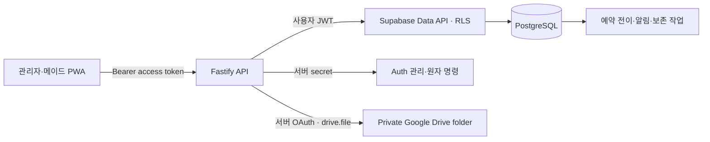
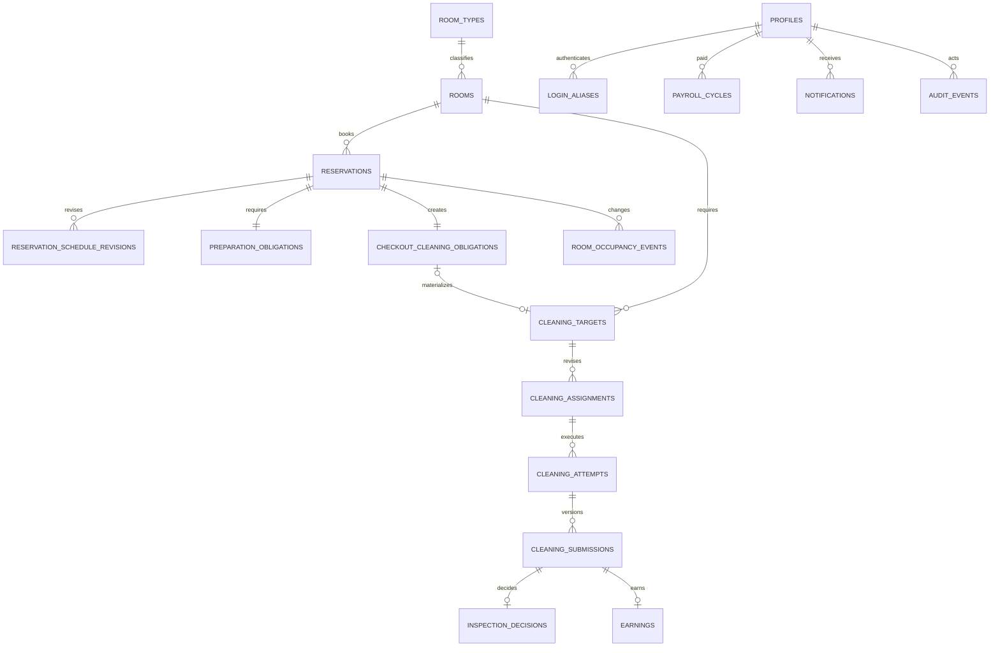

# 백엔드 서버 설계

> 문서 지위: 설계 검토 초안이다. 구현 전에 [백엔드 AI 제품·도메인 가이드](./AI_BACKEND_PRODUCT_GUIDE.md)를 먼저 읽는다. 이 문서와 ERD/DBML은 제품 가이드와 reconcile되기 전에는 목표 계약이 아니며, `[미확정]` 정책을 기존 코드나 이 문서만으로 확정하지 않는다.

## 기술 선택

- API: Node.js 22, Fastify 5, TypeScript
- 데이터·인증: Supabase Auth, PostgreSQL 17
- 사진 파일: Google Drive API, 전용 비공개 폴더
- 입력 검증: Zod
- 테스트: Vitest와 Fastify injection
- 배포 단위: 상태 없는 API 서버 + Supabase 운영 프로젝트 + Supabase 복구검증 프로젝트

Fastify는 작은 초기 서버에서 모듈 경계를 명확히 유지하면서도 요청 처리 비용이 낮습니다. 핵심 정합성은 API 메모리가 아니라 PostgreSQL 제약과 트랜잭션에 둡니다.

## 신뢰 경계

- 브라우저에는 publishable key만 허용합니다.
- secret/service-role 키는 서버에서만 사용하고 로그에 남기지 않습니다.
- 조회는 가능한 한 사용자 JWT와 RLS를 통과시킵니다.
- 계정 생성·비밀번호 초기화·여러 원장을 함께 바꾸는 명령만 서버 secret과 DB 함수를 사용합니다.
- Google Drive access/refresh token은 서버 secret으로만 보관하며 브라우저는 Drive에 직접 접근하지 않습니다.

## 인증

1. 서버가 먼저 불변 profile UUID를 만들고, 관리자가 그 ID로 Supabase Auth 사용자를 생성합니다.
2. 내부 이메일은 `user-{profile_id}@auth.castletheart.invalid` 형식으로 서버만 계산합니다.
3. 사용자가 이름형 `loginId`와 최초 휴대전화 끝 4자리 임시 비밀번호 또는 숫자 6자리 이상 개인 비밀번호를 보냅니다. 4자리 임시값은 서버 내부에서만 Supabase 최소 길이를 만족하는 namespace 값으로 변환합니다.
4. 서버가 활성 alias와 프로필을 찾고 5회 실패/15분 잠금을 검사합니다.
5. 서버가 Supabase Auth password 로그인을 수행해 access/refresh token을 반환합니다.
6. 이후 API는 `auth.getUser(accessToken)`과 `auth.sessions`의 `session_id`를 검증하고 최신 프로필 역할·상태를 다시 읽습니다.

권한은 사용자 수정 가능한 `user_metadata`에 의존하지 않습니다. 역할 변경과 비활성화가 JWT 갱신 전에도 반영되도록 DB 프로필을 매 요청 확인합니다.

## 데이터 모델

색상이나 `투숙 중/청소 필요/배정 가능/배정 불가` 같은 복합 UI 상태는 저장하지 않습니다. 예약·수동 점유 보정·운영 중지·청소 단계·촛불·차단 이슈에서 파생합니다.

## 동시성과 멱등성

| 작업 | 서버 보장 |
|---|---|
| 객실·예약 명령 | actor 최신 상태·admin 역할 + 객실 `state_version`/예약 `version` CAS + actor/명령별 idempotency key + 짧은 전역 advisory lock으로 lock 순서 고정 |
| 예약 저장 | KST 기준 최소 1박·분 단위 + `[check_in_at, check_out_at)` `tstzrange` GiST exclusion으로 겹침 차단 |
| 입·퇴실 전이 | 고유 event key + 예약 lock으로 예정/수동 전이 중복 차단. 한 batch에서는 퇴실을 먼저 닫아 같은 instant의 다음 입실을 지연시키지 않고, worker 중단 중 완전히 지난 미입실 예약도 가짜 check-in 없이 checkout으로 catch-up |
| 청소 요청 | 예약·객실·checkout obligation·target을 양방향 복합키로 고정하고 동일 obligation을 한 번만 materialize. 연박/추가 수동 요청은 점유·접근 구간과 겹침을 검증한 안정적인 target ID 및 CAS soft cancel |
| 입실 준비 증명 | preparation obligation의 current attempt와 approved submission을 같은 수행으로 묶고, 직전 점유 종료 이후부터 해당 체크인 이전까지 같은 객실에서 승인된 제출만 `approved` 허용. submission 소비 원장은 append-only·전역 unique라 다른 예약에 재사용할 수 없음 |
| PIN lease | 객실·예약·target·현재 assignment·현재 attempt·담당 메이드·최신 verified PIN version을 한 계약으로 묶음. 수동 checkout은 stale lease를 폐기하고 현재 verified version으로 현재 미공개 lease 한 건만 새 revision으로 재발급 |
| 담당 변경 | 대상 `assignment_version` CAS + 현재 담당 partial unique |
| 청소 시작 | 메이드별 `in_progress` partial unique |
| 제출 | `client_submission_id` unique + 회차별 현재 제출 unique |
| 검수 | 제출별 decision unique, 현재 `submitted` 버전만 조건부 전이 |
| 수익 | submission/entitlement unique |
| 지급 | `(maid_profile_id, week_start)` unique + earning의 `earned_on` 주차 일치 + `payroll_items.earning_id` exclusive claim + PAYING 이후 snapshot 불변 + 미송금 사유 기록 reopen + version CAS |
| 알림 | 수신자별 dedupe key unique, 10분 group key |

복수 테이블을 바꾸는 예약 저장·변경·취소·체크아웃은 현재 SQL RPC에서 짧은 transaction으로 예약, obligation, revision/event, 감사 원장을 함께 커밋합니다. 배정 통보·검수·지급도 같은 원칙으로 후속 구현합니다. 외부 Drive·push 호출은 transaction 밖에서 outbox worker가 처리합니다.

## RLS 원칙

- `public`의 모든 테이블은 RLS를 활성화합니다.
- `anon`에는 테이블 권한을 주지 않습니다.
- 메이드는 본인 담당·수행·제출·수익·지급·알림만 읽습니다.
- 관리자는 운영 테이블을 관리하지만 객실 PIN 원문은 전용 조회 함수로만 받습니다.
- view는 `security_invoker = true`를 사용합니다.
- 일반 Data API RLS의 profile/role 보조 함수는 `active` 계정만 식별합니다. `deactivation_pending`과 `upload_only`는 일반 역할이 아니라 만료 가능하고 업무 revision에 묶인 서버 전용 제한 capability로만 처리합니다.
- 알림 수신자가 직접 바꿀 수 있는 필드는 `read_at`뿐입니다. `resolved_at`은 관련 업무 command만 service-role transaction에서 변경합니다.
- 내부 권한 함수는 `private` 스키마, 고정 `search_path`, 최소 반환값, 명시적 EXECUTE 권한을 사용합니다.
- 사진 파일은 Drive에서 공개 공유하지 않습니다. API가 사용자 역할과 제출 소유권을 검사한 뒤 업로드·열람·삭제를 대행합니다.
- Supabase에는 Drive 파일 ID·해시·크기·삭제예정일만 저장하고, 사진 레코드 쓰기는 서버 역할에만 허용합니다.
- 인증 사용자의 직접 DML은 본인 알림의 `read_at`으로 제한합니다. `resolved_at`과 업무 상태 변경은 서버 명령/RPC만 사용합니다.
- 상세 역할 매트릭스와 상태 변경 규칙은 [Auth·RLS 계약](./AUTH_RLS_CONTRACT.md)을 따릅니다.

## API 단계

현재:

- `GET /health`
- `POST /v1/auth/login`
- `GET /v1/auth/me`
- `POST /v1/auth/password`
- `GET·POST /v1/accounts`
- `PATCH /v1/accounts/:profileId/role`
- `PATCH /v1/accounts/:profileId/status`
- `POST /v1/accounts/:profileId/unlock`
- `POST /v1/accounts/:profileId/password-reset`
- `GET /v1/rooms`, `GET /v1/rooms/:roomId` (관리자 전용 운영 projection)
- 객실 기준정보 변경, 운영 차단·해제, 촛불 수량 event, 이슈 등록·해결, PIN 동기화 결과 기록
- `GET·POST /v1/reservations`, `GET /v1/reservations/:reservationId`
- `POST /v1/reservations/cleaning-requests`, `POST /v1/reservations/cleaning-requests/:targetId/cancel`
- 예약 일정 변경·취소·수동 체크아웃과 예약 시각 기반 전이 처리

다음 구현:

- 주간 가능일 제출, 오늘/내일 청소 대상, 배정·순서 통보
- 300KiB 사진 업로드, 인증된 사진 스트리밍, 현장 완료, 전체 제출
- 검수 승인/반려, 폭탄방 판정, 재청소
- 메이드별 주급과 지급 상태
- 역할별 알림함과 푸시 구독

## 원격 환경 현황

- Free 조직: `yeosucastletheart@gmail.com's Org`
- 운영: 서울 `room-management-system-prod` (`aodikrxcczbogjpsjwjt`)
- 복구검증: 뭄바이 기존 프로젝트 (`matalcofimnhuzslfhdd`), 사용자 트래픽 금지
- 두 프로젝트 생성 비용은 월 `$0`로 확인

아직 필요한 설정:

- Data API 노출 스키마 확인
- publishable/secret key를 로컬·배포 환경에 각각 저장
- 실제 관리자 계정 1개 seed 후 로그인·RLS 통합 테스트
- Google Cloud Drive API OAuth 앱, 전용 운영 계정, 비공개 루트 폴더와 refresh token 설정

예약 고객명은 API 서버에서 AES-256-GCM으로 암호화해 `reservations.guest_name_encrypted`에만 저장합니다. 현재 키와 버전은 `RESERVATION_PII_KEY_BASE64`, `RESERVATION_PII_KEY_VERSION`, 이전 복호화 키는 secret인 `RESERVATION_PII_KEYRING_JSON`으로 관리합니다. 목록에는 이름을 포함하지 않고 관리자 단건 상세에서만 복호화하며, 체크아웃 또는 투숙 전 취소 후 180일이 지나면 예약 전이 worker가 암호문을 제거합니다. 멱등성 hash에는 평문 대신 서버 키 HMAC fingerprint만 사용하고 응답·감사 event에는 암호문이나 원문을 복제하지 않습니다. 객실 PIN도 원문 대신 동기화 상태와 PIN version만 일반 업무 원장에 기록합니다.

`RESERVATION_SCHEDULER_ACTOR_PROFILE_ID`는 production에서 활성 관리자 profile ID로 반드시 설정합니다. 서버는 시작 즉시 첫 실행을 성공시켜 actor의 최신 역할·상태를 검증한 뒤에만 기동을 완료하고, 이후 설정된 간격마다 예정 입·퇴실 전이와 고객명 보존 만료를 처리합니다. 한 번에 퇴실을 먼저 처리하므로 반개구간 경계의 다음 입실이 같은 batch에서 진행되고, 중단 기간 전체가 지난 미입실 예약도 가짜 check-in 없이 예정 checkout으로 종결됩니다. local/development에서만 값을 생략해 worker를 끄고 관리자 전이 endpoint로 같은 command를 수동 실행할 수 있습니다.

다음 예약이 바뀌면 앞 예약의 준비 마감은 종결되지 않은 obligation만 다시 계산합니다. 아직 미배정인 materialized target은 CAS version과 schedule revision을 함께 올리고, 이미 배정·통보된 target은 암묵적으로 덮어쓰지 않고 `CLEANING_DUE_REPLAN_REQUIRED`로 거부해 명시적 재계획을 요구합니다.

고객명 암호화 key version과 idempotency HMAC pepper는 분리합니다. 암호화 키를 회전해도 안정적인 `RESERVATION_GUEST_NAME_PEPPER`는 계획된 별도 migration 전까지 유지하므로 기존 idempotency key 재시도가 다른 요청으로 오인되지 않습니다.

2026-08-28에 운영·복구검증 프로젝트에 P0·계정 수명주기·도메인 무결성 migration을 적용했다. 두 프로젝트에서 구조 검사 22건과 rollback DML 검사 17건이 통과했고 Security Advisor 경고는 0건이다. Performance Advisor에는 아직 업무 데이터가 없어 예상되는 unused-index 정보만 남아 있다. Issue #1 객실·예약 migration은 아직 두 원격 프로젝트에 적용하지 않았다.

## 백업·복구

- 마이그레이션 SQL은 GitHub의 `supabase/migrations/`를 정본으로 사용한다.
- Free Plan의 두 번째 프로젝트는 최신 논리 dump를 실제로 복원하는 warm recovery copy로 사용한다.
- 매일 roles·schema·data dump를 만들고 recovery 프로젝트에 복원한 뒤 핵심 행 수·RLS·관리자·객실 seed를 검사한다.
- DB dump는 Google Drive 사진 파일을 포함하지 않으므로 사진은 업로드 후 7일 자동삭제 정책으로 별도 운영한다.
- 전체 주기와 복원 명령은 [백업·복구 운영안](./BACKUP_AND_RECOVERY.md)에 정의한다.
