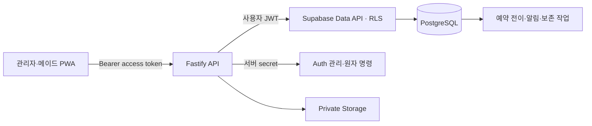
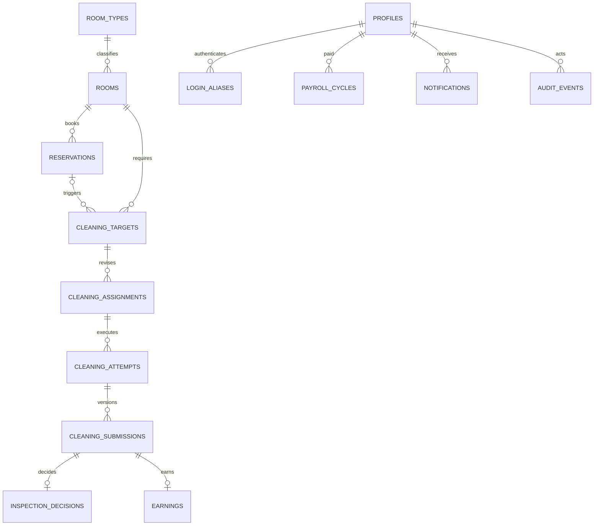

# 백엔드 서버 설계

## 기술 선택

- API: Node.js 22, Fastify 5, TypeScript
- 데이터·인증·파일: Supabase Auth, PostgreSQL 17, Storage
- 입력 검증: Zod
- 테스트: Vitest와 Fastify injection
- 배포 단위: 상태 없는 API 서버 + Supabase 프로젝트

Fastify는 작은 초기 서버에서 모듈 경계를 명확히 유지하면서도 요청 처리 비용이 낮습니다. 핵심 정합성은 API 메모리가 아니라 PostgreSQL 제약과 트랜잭션에 둡니다.

## 신뢰 경계

- 브라우저에는 publishable key만 허용합니다.
- secret/service-role 키는 서버에서만 사용하고 로그에 남기지 않습니다.
- 조회는 가능한 한 사용자 JWT와 RLS를 통과시킵니다.
- 계정 생성·비밀번호 초기화·여러 원장을 함께 바꾸는 명령만 서버 secret과 DB 함수를 사용합니다.

## 인증

1. 서버가 먼저 불변 profile UUID를 만들고, 관리자가 그 ID로 Supabase Auth 사용자를 생성합니다.
2. 내부 이메일은 `user-{profile_id}@auth.castletheart.invalid` 형식으로 서버만 계산합니다.
3. 사용자가 이름형 `loginId`와 숫자 6자리 이상 로그인 비밀번호를 보냅니다.
4. 서버가 활성 alias와 프로필을 찾고 5회 실패/15분 잠금을 검사합니다.
5. 서버가 Supabase Auth password 로그인을 수행해 access/refresh token을 반환합니다.
6. 이후 API는 `auth.getUser(accessToken)`으로 토큰을 검증하고 최신 프로필 역할·상태를 다시 읽습니다.

권한은 사용자 수정 가능한 `user_metadata`에 의존하지 않습니다. 역할 변경과 비활성화가 JWT 갱신 전에도 반영되도록 DB 프로필을 매 요청 확인합니다.

## 데이터 모델

색상이나 `투숙 중/청소 필요/배정 가능/배정 불가` 같은 복합 UI 상태는 저장하지 않습니다. 예약·수동 점유 보정·운영 중지·청소 단계·촛불·차단 이슈에서 파생합니다.

## 동시성과 멱등성

| 작업 | 서버 보장 |
|---|---|
| 예약 저장 | `tstzrange` + GiST exclusion으로 겹침 차단 |
| 청소 요청 | 객실별 활성 대상 partial unique + `source_key` |
| 담당 변경 | 대상 `assignment_version` CAS + 현재 담당 partial unique |
| 청소 시작 | 메이드별 `in_progress` partial unique |
| 제출 | `client_submission_id` unique + 회차별 현재 제출 unique |
| 검수 | 제출별 decision unique, 현재 `submitted` 버전만 조건부 전이 |
| 수익 | submission/entitlement unique |
| 지급 | `(maid_profile_id, week_start)` unique + version CAS |
| 알림 | 수신자별 dedupe key unique, 10분 group key |

복수 테이블을 바꾸는 예약 저장, 배정 통보, 검수, 지급은 다음 단계에서 SQL RPC로 구현하고 감사 이벤트까지 같은 트랜잭션으로 커밋합니다.

## RLS 원칙

- `public`의 모든 테이블은 RLS를 활성화합니다.
- `anon`에는 테이블 권한을 주지 않습니다.
- 메이드는 본인 담당·수행·제출·수익·지급·알림만 읽습니다.
- 관리자는 운영 테이블을 관리하지만 객실 PIN 원문은 전용 조회 함수로만 받습니다.
- view는 `security_invoker = true`를 사용합니다.
- 내부 권한 함수는 `private` 스키마, 고정 `search_path`, 최소 반환값, 명시적 EXECUTE 권한을 사용합니다.
- Storage는 private bucket이며 사용자 UUID 첫 경로와 owner를 검사합니다. 업로드는 불변 객체로 처리해 upsert 권한을 주지 않습니다.

## API 단계

현재:

- `GET /health`
- `POST /v1/auth/login`
- `GET /v1/auth/me`
- `GET /v1/rooms`

다음 구현:

- 관리자 계정 생성·복구·비밀번호 초기화
- 객실 상세·기준정보 변경
- 예약 CRUD와 자동/수동 체크아웃 명령
- 주간 가능일 제출, 오늘/내일 청소 대상, 배정·순서 통보
- 사진 업로드 URL, 현장 완료, 전체 제출
- 검수 승인/반려, 폭탄방 판정, 재청소
- 메이드별 주급과 지급 상태
- 역할별 알림함과 푸시 구독

## 아직 필요한 원격 설정

- 요청 계정 `yeosucastletheart@gmail.com`으로 Supabase 플러그인 재인증
- 생성할 조직과 요금 확인 후 프로젝트 생성
- Data API 노출 스키마 확인
- 마이그레이션 적용, RLS advisor와 performance advisor 확인
- publishable/secret key를 로컬·배포 환경에 각각 저장
- 실제 관리자 계정 1개 seed 후 로그인·RLS 통합 테스트
