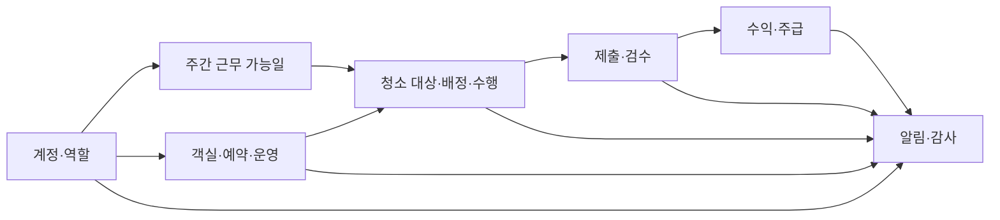
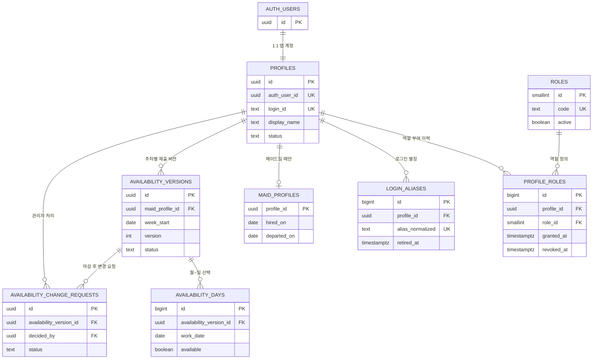
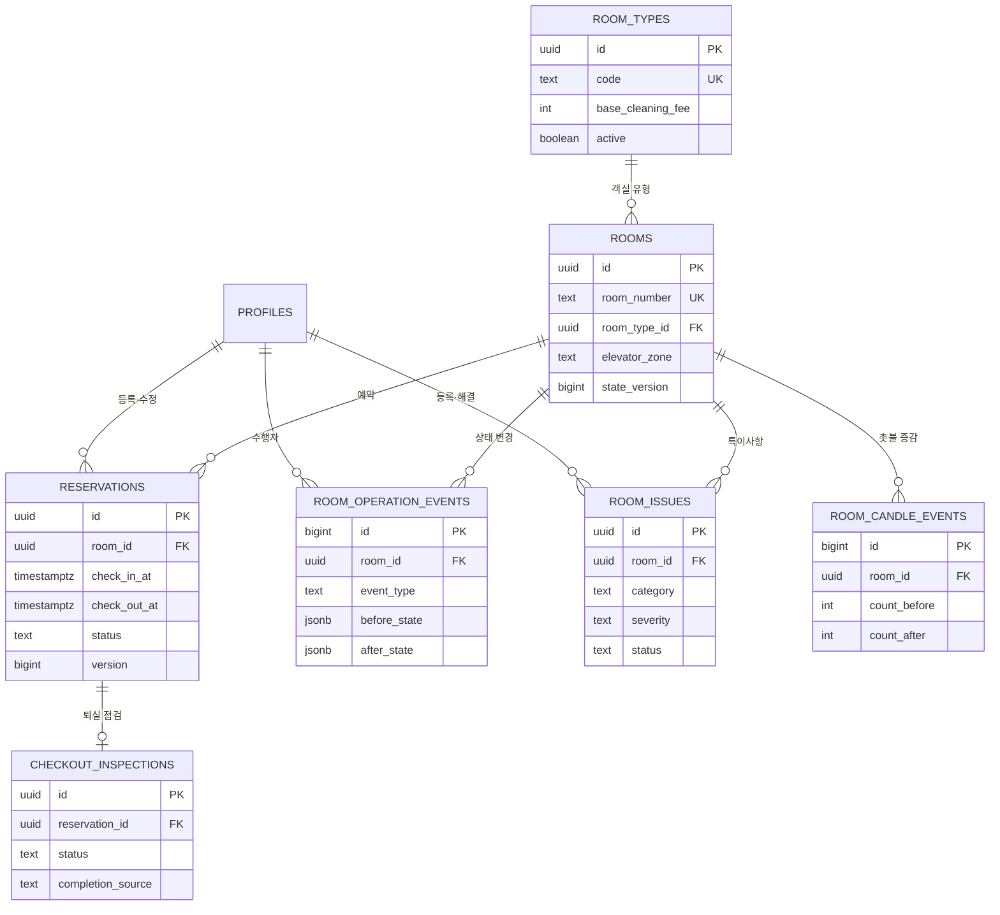
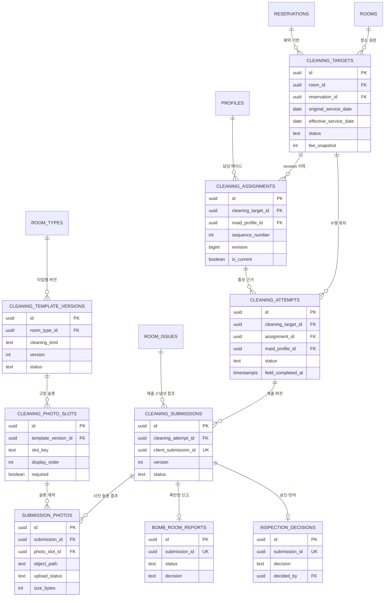
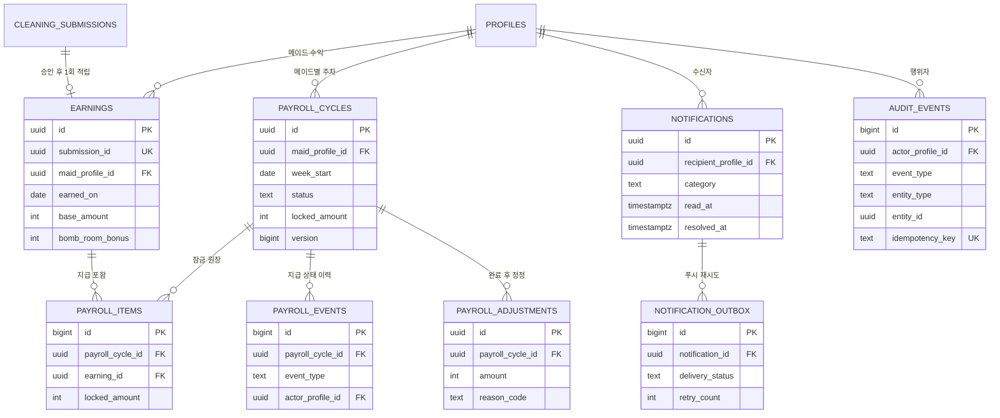

# Room Management System ERD 초안

> 상태: **검토용 v1**  
> 이 문서는 구현 전에 관계와 운영 규칙을 합의하기 위한 초안이다. 아직 Supabase 원격 DB에는 적용하지 않았다.

## 1. 설계 결론

- 관리자와 메이드는 인원 수를 코드나 enum에 고정하지 않는다.
- 한 로그인 계정은 `profiles` 한 건을 가지며, 역할은 `roles`와 `profile_roles`에서 부여·회수한다.
- `admin`, `maid`는 초기 역할 데이터일 뿐이다. 이후 `inspector` 같은 역할을 추가해도 사용자 테이블을 변경하지 않는다.
- 메이드 전용 인사 정보만 `maid_profiles`에 분리한다. 관리자는 별도 관리자 테이블 없이 역할로 판정한다.
- 계정과 역할은 물리 삭제하지 않고 `status`, `revoked_at`으로 종료해 과거 배정·검수·급여 이력을 보존한다.
- 관리자 계정 추가/메이드 계정 추가는 서버의 관리자 전용 명령에서 `auth.users → profiles → profile_roles → login_aliases`를 한 트랜잭션처럼 처리한다.
- 공개 스키마의 모든 테이블은 RLS를 사용하고, 역할 판정은 사용자 수정이 가능한 JWT `user_metadata`가 아니라 DB의 활성 `profile_roles`를 조회한다.

## 2. 전체 도메인 지도

## 3. 계정·역할·근무 가능일

핵심 제약:

- `(profile_id, role_id)`에는 활성 역할 한 건만 허용한다.
- 최소 한 명의 활성 관리자는 항상 남겨야 한다.
- 활성 메이드만 근무 가능일을 제출할 수 있다.
- `(maid_profile_id, week_start, version)`은 유일하고, 주차별 현재 제출 버전은 한 건이다.
- 메이드 후보 목록은 `활성 계정 + 활성 maid 역할 + 해당 날짜 available`을 모두 만족해야 한다.

## 4. 객실·예약·운영

## 5. 청소 배정·수행·검수

핵심 제약:

- 객실마다 종료되지 않은 활성 청소 대상은 최대 한 건이다.
- 작업마다 현재 배정은 최대 한 건이고, 과거 revision은 삭제하지 않는다.
- 메이드마다 `in_progress` 수행 회차는 최대 한 건이다.
- 제출은 `client_submission_id`로 멱등 처리하며, 수행 회차별 현재 제출은 한 건이다.
- 사진은 Supabase Storage의 비공개 버킷에 저장하고 DB에는 경로·해시·크기·상태만 둔다.
- 제출 당시 템플릿과 슬롯을 스냅샷으로 고정해 이후 템플릿 변경이 과거 검수에 소급되지 않게 한다.

## 6. 수익·주급·알림·감사

## 7. Supabase Free Plan 전용 운영 기준

2026-08-25 기준 공식 Free Plan 범위 안에서만 사용한다.

| 항목 | Free 한도 | 이 프로젝트 기준 |
|---|---:|---|
| 활성 프로젝트 | 최대 2개 | 운영 1개 + 최신 논리 백업 복구검증 1개, 유료 DB 브랜치 미사용 |
| Auth | 총 사용자 무제한, 월 활성 사용자 50,000명 | 관리자·메이드 수를 앱에서 고정하지 않음 |
| Database | 프로젝트당 500MB | 400MB 경고, 감사 JSON 크기 제한, 불필요한 중복 스냅샷 금지 |
| Storage | 조직당 1GB | 비공개 버킷 1개, 사진 1장 3MB 가정, 업로드일로부터 30일 보관 |
| Egress | 5GB + cached 5GB | 서명 URL을 짧게 사용하고 동일 검수 화면에서 중복 다운로드 억제 |
| Realtime | 월 200만 메시지, 동시 200연결 | MVP 핵심 경로에는 미사용, 필요 화면만 제한 구독 |
| Edge Functions | 월 500,000회 | 초기 백엔드는 Fastify 서버 사용, 정리 작업만 필요 시 검토 |

사진은 업로드일로부터 30일 동안 유지하고 30일이 지난 객체만 정리한다. 계산은 월 길이와 삭제 작업 지연을 고려해 31일 보유를 기준으로 한다. 1GB를 보수적으로 1,000MB로 계산하면 이론상 `1,000MB ÷ 3MB ÷ 31일 = 10.75장/일`이므로 하루 10장이 절대 상한에 가깝다. 하루 11장이면 `11 × 3MB × 31일 = 1,023MB`로 Free 한도를 넘는다.

| 하루 평균 | 31일 보관량 | 판정 |
|---:|---:|---|
| 8장 | 744MB | 권장 운영선, 약 25% 여유 |
| 9장 | 837MB | 주의, 증빙·썸네일·삭제 지연 여유가 작음 |
| 10장 | 930MB | 이론상 가능하지만 운영 여유가 거의 없음 |
| 11장 | 1,023MB | Free Storage 한도 초과 |

따라서 **안전한 평균은 하루 8장**, 경고선은 하루 9장, 하드 제한은 하루 10장으로 본다. 현재 객실 타입별 필수 사진이 10·11·13·15장이므로 3MB 원본을 그대로 한 달 보관하면 Free Plan에서는 하루 청소 한 객실조차 안정적으로 수용하지 못한다. 평균 12.25장/청소 기준 안전 운영량은 약 `8 ÷ 12.25 = 0.65건/일`, 즉 월 약 20건이다. 실제 운영량이 이를 넘으면 1GB Free Storage와 `3MB × 30일` 조건을 동시에 만족할 수 없다.

사진 업로드는 Fastify 서버를 경유하지 않고 서버가 발급한 제한된 업로드 경로를 사용해 클라이언트에서 Supabase Storage로 직접 전송한다. 따라서 3MB 파일 자체는 API 서버 메모리에 부담을 주지 않는다. 검수 화면은 사진을 자동으로 전부 내려받지 않고 필요할 때만 열어 5GB uncached egress도 보호한다. Storage 객체를 지운 뒤에도 제출 메타데이터·해시·크기·검수 결과는 DB에 보존한다.

Free 프로젝트는 낮은 활동이 7일 이어지면 일시 정지될 수 있고 공식 일일 백업 보장·PITR·DB branching·SLA가 없다. 마이그레이션 정본은 Git에 보관하고, 두 번째 Free 프로젝트에는 주기적으로 최신 논리 백업을 복원해 실제 복구 가능성을 검증한다. 구체적인 절차는 [백업·복구 운영안](./BACKUP_AND_RECOVERY.md)을 따른다.

공식 근거:

- [Supabase Pricing](https://supabase.com/pricing)
- [Supabase billing guide](https://supabase.com/docs/guides/platform/billing-on-supabase)
- [Supabase Free project pausing](https://supabase.com/docs/guides/platform/free-project-pausing)
- [Supabase Storage usage](https://supabase.com/docs/guides/platform/manage-your-usage/storage-size)

## 8. 무료 ERD 사이트에서 확인하기

전체 상세 스키마는 [`room-management-system.dbml`](./room-management-system.dbml)에 있다.

1. [dbdiagram.io](https://dbdiagram.io/)에서 새 다이어그램을 만든다.
2. `room-management-system.dbml` 내용을 붙여 넣는다.
3. 관계선을 이동해 원하는 배치로 정리하고 PNG/PDF로 내보낸다.

위 Mermaid 블록은 [Mermaid Live Editor](https://mermaid.live/edit)에서도 바로 확인할 수 있다.

## 9. 승인 뒤 반영 순서

1. 기존 `profiles.role enum`을 `roles + profile_roles`로 교체한다.
2. 근무 가능일 3개 테이블을 먼저 추가한다.
3. 사진 manifest JSON을 슬롯·사진 테이블로 정규화한다.
4. 배열로 저장하던 지급 수익 ID를 `payroll_items`로 정규화한다.
5. 인덱스·RLS·명시적 GRANT·관리자 계정 생성 명령을 추가한다.
6. 올바른 `yeosucastletheart@gmail.com` Supabase 계정의 Free 조직인지 확인한 뒤에만 원격 프로젝트를 생성한다.
