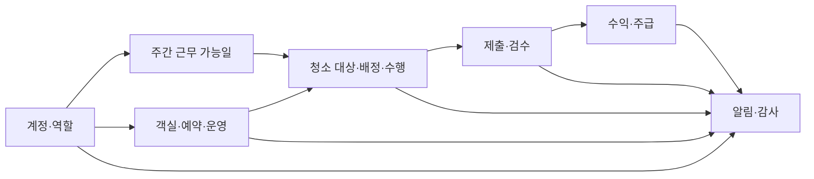
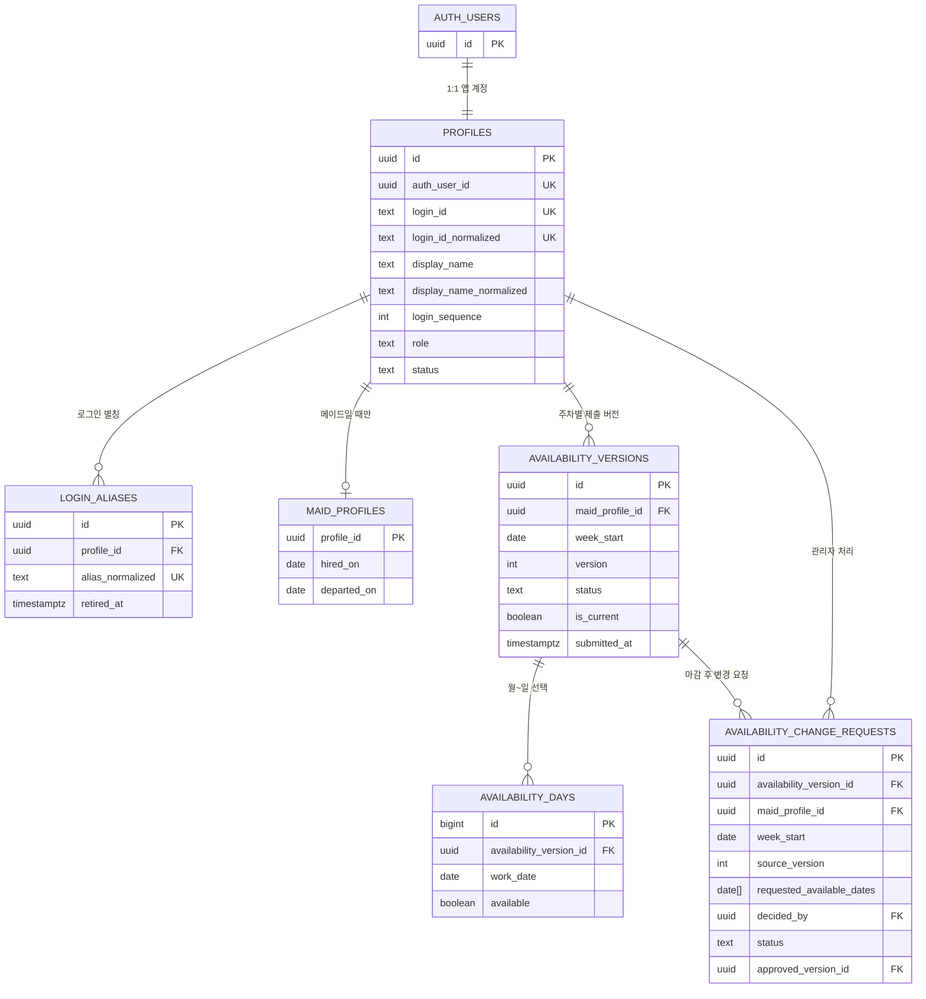
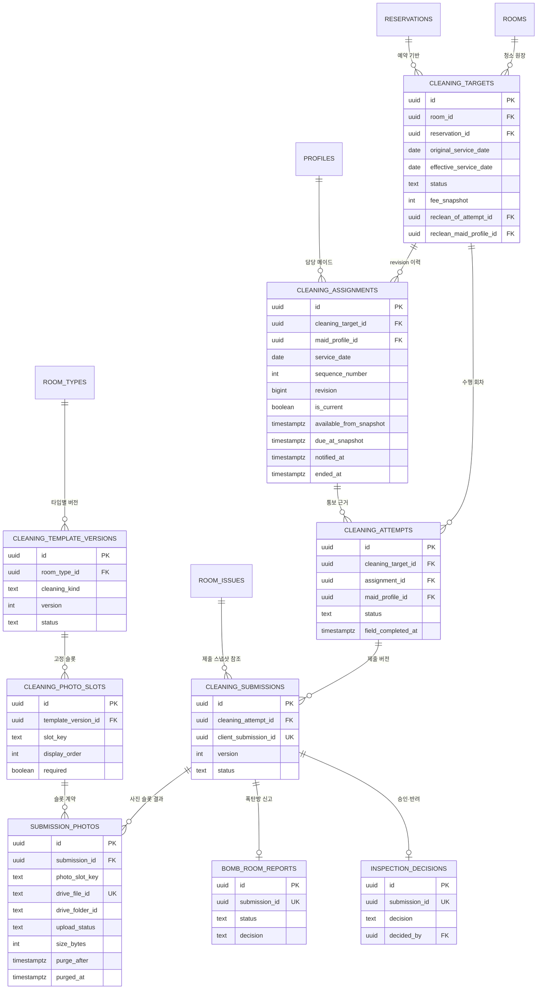
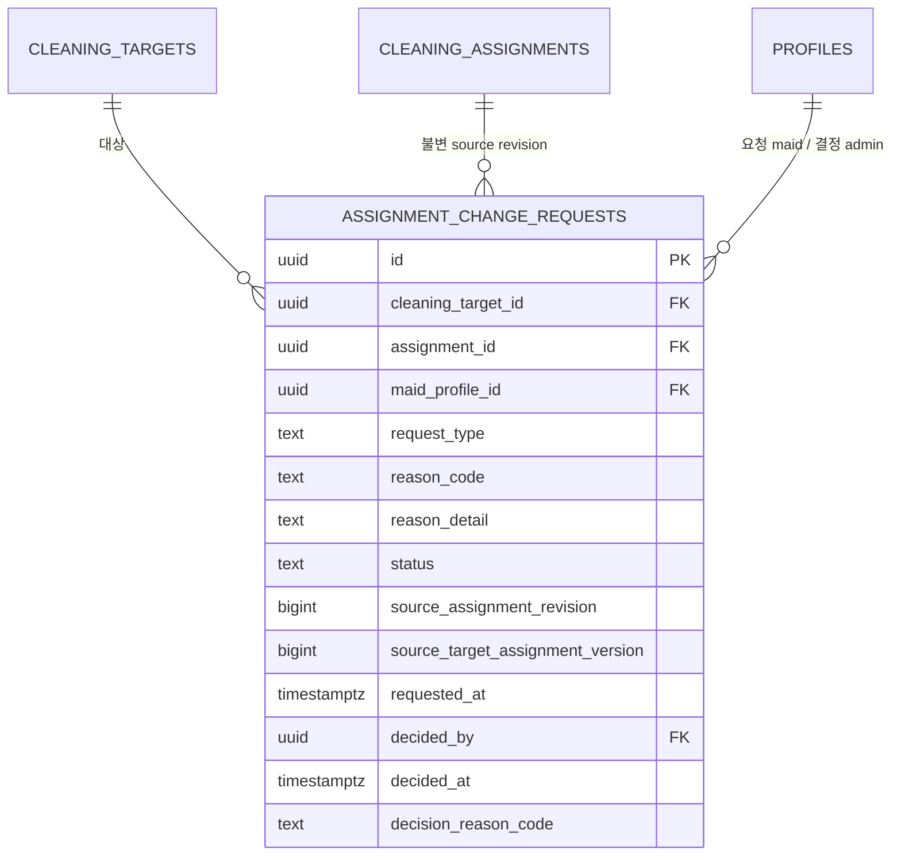
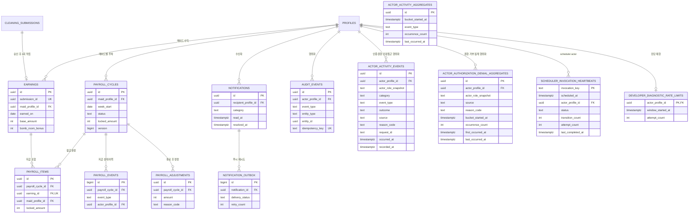

# Room Management System ERD 초안

> 상태: **검토용 v4**
> P0 핵심 스키마·계정 수명주기·도메인 무결성 계약은 migration으로 관리하며, 이후 업무 API와 원장은 구현 순서에 따라 확장한다.
> 제품 계약과 미확정 사항은 [백엔드 AI 제품·도메인 가이드](./AI_BACKEND_PRODUCT_GUIDE.md)를 우선한다.

## 1. 설계 결론

- 관리자와 메이드는 인원 수를 코드나 enum에 고정하지 않는다.
- 한 로그인 계정은 `profiles` 한 건을 가지며 현재 제품 역할은 `developer | admin | maid`다. developer는 singleton이고 admin·maid 계정 수에는 제한이 없다.
- 메이드 전용 인사 정보만 `maid_profiles`에 분리한다. 관리자는 별도 관리자 테이블 없이 역할로 판정한다.
- 계정과 역할은 물리 삭제하지 않고 `status`, `revoked_at`으로 종료해 과거 배정·검수·급여 이력을 보존한다.
- 관리자 계정 추가/메이드 계정 추가는 서버의 developer/admin 계정 명령에서 `auth.users → profiles + login_aliases + audit_events`를 보상 트랜잭션으로 처리한다.
- 공개 스키마의 모든 테이블은 RLS를 사용하고, 역할 판정은 사용자 수정이 가능한 JWT `user_metadata`가 아니라 DB `profiles.role`을 조회한다.

## 2. 전체 도메인 지도

## 3. 계정·역할·근무 가능일

핵심 제약:

- 역할은 singleton `developer`와 복수 `admin | maid`다. developer는 계정 관리만 하고 일반 업무 capability는 active admin이 가진다.
- 최소 한 명의 활성 관리자는 항상 남겨야 한다.
- 활성 메이드만 근무 가능일을 제출할 수 있다.
- `(maid_profile_id, week_start, version)`은 유일하고, 주차별 현재 제출 버전은 한 건이다.
- version은 7개 날짜 row를 명시적으로 가지며, 새 제출·승인 version이 생겨도 이전 version과 날짜는 삭제하지 않는다.
- 일요일 12:00–23:59 KST의 일반 제출은 `expectedVersion` CAS와 idempotency key로 직렬화한다.
- 마감 뒤 변경은 pending 요청을 만들고 활성 관리자의 승인 시에만 새 current version으로 전환한다.
- 메이드 후보 목록은 `활성 계정 + 활성 maid 역할 + 해당 날짜 available`을 모두 만족해야 한다.

## 4. 객실·예약·운영

핵심 제약:

- 활성 예약 구간은 `[check_in_at, check_out_at)` 반개구간이며 GiST exclusion으로 객실별 겹침을 막는다. KST 날짜가 다음 날 이상이고 분 단위인 일정만 허용한다.
- 예약마다 입실 준비 의무와 비공개 퇴실 청소 의무를 정확히 하나씩 만든다. 퇴실 청소 대상은 필요 시 같은 의무에서 한 번만 공개한다.
- 퇴실 의무와 checkout target은 예약·객실·의무 ID 복합키와 deferred constraint trigger로 commit 시점까지 양방향 동일성을 강제한다. `completed`는 동일 target의 승인 근거가, `cancelled`의 historical pointer는 동일 target의 취소 상태가 있어야 한다.
- 입실 준비 `approved`는 같은 current attempt가 승인 상태이고, target 접근 가능 시각 이후 `시작 → 현장 완료 → 종료 → 제출 → 승인` 순서가 직전 점유 종료 이후·해당 체크인 이전에 같은 객실에서 완결됐음을 요구한다. `private.preparation_proof_usages`는 submission 소비를 append-only·전역 unique로 기록해 무효화 뒤에도 다른 예약에서 재사용하지 못하게 한다.
- 예약 일정, 점유, 촛불, PIN 동기화 이력은 append-only다. 예약·객실 current row는 CAS version으로만 갱신한다.
- 예약 취소는 입실 전에만 soft cancel한다. 수동 체크아웃은 예정 일정을 덮어쓰지 않고 실제 시각과 점유 event를 추가한다.
- 연박·추가 청소 요청은 `cleaning_targets`의 안정적인 ID와 `stayover_request`/`manual_room_request` source로 생성한다. 실제 초과 점유와 자정을 넘는 access window까지 interval로 충돌 검사하고, 시작 또는 PIN 공개 전까지만 CAS version으로 soft cancel하며 대상·담당·수행 이력은 삭제하지 않는다.
- 고객명 암호문은 예약에만 존재하고 목록 projection에서는 제외한다. 관리자 단건 상세에서만 복호화하며 체크아웃/취소 후 180일 보존 만료 시 암호문만 제거한다.
- 고객 배정에는 PIN 동기화 `verified`와 객실 기준정보 확인을 포함한 독립 readiness 조건을 모두 요구한다. PIN 원문은 이 ERD의 일반 업무 테이블에 저장하지 않는다.
- PIN lease는 target·현재 assignment·현재 attempt·담당 메이드·최신 verified PIN version을 함께 고정하며 다른 객실/예약/과거 담당을 조합할 수 없다. PIN version이 바뀐 뒤 수동 checkout은 stale lease를 revoke-only하고 최신 version으로만 새 lease를 만든다.
- 퇴실점검 lifecycle은 아직 `[미확정]`이므로 `checkout_inspections`를 구현된 목표 테이블처럼 두지 않는다.

## 5. 청소 배정·수행·검수

핵심 제약:

- 같은 객실의 서로 다른 미래 예약은 각각 checkout 청소 대상을 가질 수 있다.
- 같은 예약의 예정/수동 checkout은 합쳐서 청소 대상 한 건이며 `source_key` 재시도도 한 건으로 수렴한다.
- 예약 생성 시 obligation의 `planned_cleaning_target_id`가 정확히 하나의 checkout target을 참조한다. private 의무와 배정 계획은 별개 lifecycle 축이며 current pointer는 실제 checkout 전 null이다.
- 오늘/내일 계획 배정·통보는 가능하지만 checkout attempt/PIN은 materialized current target과 실제 checkout/access 시각 검증을 통과해야 한다. #28만 attempt 활성화를 소유한다.
- 실제 checkout은 같은 planned target을 current로 승격한다. 조기 수동 퇴실은 schedule/assignment revision, 미통보 예약 변경은 draft stale, 통보 후 변경은 explicit replan, 취소는 soft cancel/current 종료/회수 알림으로 처리한다.
- 작업마다 현재 배정은 최대 한 건이고, 과거 revision은 삭제하지 않는다.
- 현재 배정의 `(maid, service_date, sequence_number)`는 유일하다. 같은 순서는 메이드나 서비스 날짜가 다를 때만 재사용한다.
- 배정 revision은 생성 시 target의 `effective_service_date`, `available_from`, `due_at`을 snapshot으로 고정하고 target·maid·순서·revision·snapshot·변경자·생성시각을 이후 수정하지 않는다.
- #25 draft 저장은 `unassigned|draft_assigned` target만 row lock 후 `assignment_version` CAS로 갱신하며, 알림·outbox·attempt는 만들지 않는다.
- #26 commit은 KST 오늘/내일의 선택 draft만 최신 일정·active maid·current availability version과 다시 대조한다. 선택 부분집합은 전부 성공하거나 전부 롤백한다.
- 알림 확정 성공은 target/assignment, 수신자 notification, private persistent outbox, `assignment.notified` 감사를 같은 transaction에 기록한다. 외부 push와 cleaning attempt는 이 transaction에서 만들지 않는다.
- attempt는 assignment의 target·maid·revision과 모두 일치해야 하며, submission·earning의 maid도 같은 수행자를 가리킨다.
- 검수 반려 재청소는 생성 뒤에도 원 attempt·원 maid 링크를 변경할 수 없고 다른 메이드에게 배정할 수 없다.
- 메이드마다 `in_progress` 수행 회차는 최대 한 건이다.
- 제출은 `client_submission_id`로 멱등 처리하며, 수행 회차별 현재 제출은 한 건이다.
- 사진 파일은 비공개 Google Drive 폴더에만 저장하고 DB에는 Drive 파일 ID·해시·크기·삭제예정일·삭제 결과만 둔다.
- `purge_after`는 서버가 `uploaded_at + 7일`로 강제하며, 삭제 작업이 Drive 파일을 영구삭제한 뒤 `purged_at`을 기록한다.
- 제출 당시 템플릿과 슬롯을 스냅샷으로 고정해 이후 템플릿 변경이 과거 검수에 소급되지 않게 한다.

### #27 시작 전 취소 요청 원장

- assignment/target/maid/revision 복합 FK, assignment당 pending 최대 1건. source와 terminal decision은 불변이고 DELETE 금지다.
- pending → approved/rejected 또는 source 종료 시 superseded. source stale 요청으로 새 assignment를 해제할 수 없다.
- RLS는 active admin 전체/maid 본인만, developer 0. 직접 INSERT/UPDATE/DELETE와 client RPC 실행은 차단한다.
- pre-start 변경/해제/요청/결정은 non-superseded attempt가 있으면 전부 거부한다. current assignment ID + target version CAS와 공통 잠금으로 activation 경합에서 한쪽만 성공한다.
- schedule 축소는 `manual_room_request + additional` 또는 `stayover_request + stayover`만 허용한다. stayover는 actual check-in된 active reservation과 target의 reservation/room 일치 및 checkout 이전 점유 구간을 재검증한다. 다른 source-kind 조합과 날짜 이동·창 확장은 거부한다.
- notified 변경/해제는 기존 notification을 보존/resolve하고 새 알림/outbox를 추가한다. draft에는 통보가 없다. reason detail은 audit/notification에 포함하지 않는다.
- request 조회는 31일/100건 상한과 requested_at/id cursor, maid/target/assignment/decider FK indexes를 사용한다.

## 6. 수익·주급·알림·감사

- `payroll_items`는 cycle이 `OPEN`인 잠금 transaction에서만 추가하며 earning의 `earned_on`이 cycle의 월요일 시작 7일 구간에 속해야 한다.
- cycle이 `PAYING`에 진입한 뒤에는 item membership과 잠금 금액·행위자·시각 snapshot을 임의로 바꿀 수 없다. 외부 송금이 없음을 확인한 `PAYING/CHECK → OPEN`은 사유·행위자·시각과 CAS version을 기록하면서 lock metadata만 해제하며 candidate item은 유지한다. `PAID` snapshot은 되돌려 쓰지 않는다.
- scheduler heartbeat, developer 진단 제한, actor activity 원본은 `private` 운영 projection 상태다. Data API table 권한을 주지 않고 service-role도 원본 table을 직접 읽지 않으며, exact developer/admin 검증을 포함한 app-owned RPC로만 기록·조회한다.
- developer 감사 API는 `audit_events`의 raw JSON을 반환하지 않고 account·availability·reservation·cleaning·room domain event allowlist의 필드별 projection만 최대 31일·100건 cursor pagination으로 반환한다.
- 로그인·민감접근은 domain audit과 분리해 `actor_activity_events`에 append하며 저장 request ID는 server-generated UUID v4만 허용한다. unknown login 실패는 로그인 ID·IP·HMAC 없이 `actor_activity_aggregates`의 분 단위 한 row로, 권한거부는 `(actor, source, reason, UTC minute)`별 `actor_authorization_denial_aggregates` 한 row로 유지하고 두 count 모두 600에서 포화한다.

## 7. Supabase Free Plan 전용 운영 기준

2026-08-25 기준 공식 Free Plan 범위 안에서만 사용한다.

| 항목 | Free 한도 | 이 프로젝트 기준 |
|---|---:|---|
| 활성 프로젝트 | 최대 2개 | 운영 1개 + 최신 논리 백업 복구검증 1개, 유료 DB 브랜치 미사용 |
| Auth | 총 사용자 무제한, 월 활성 사용자 50,000명 | 관리자·메이드 수를 앱에서 고정하지 않음 |
| Database | 프로젝트당 500MB | 400MB 경고, 감사 JSON 크기 제한, 불필요한 중복 스냅샷 금지 |
| Storage | 조직당 1GB | 사진 파일 미사용, DB에는 Google Drive 메타데이터만 저장 |
| Egress | 5GB + cached 5GB | 사진 파일이 Data API·Storage를 통과하지 않으므로 사진 egress 미사용 |
| Realtime | 월 200만 메시지, 동시 200연결 | MVP 핵심 경로에는 미사용, 필요 화면만 제한 구독 |
| Edge Functions | 월 500,000회 | 초기 백엔드는 Fastify 서버 사용, 정리 작업만 필요 시 검토 |

사진은 프론트 앱에서 **최대 300KiB(307,200바이트)** JPEG/WebP로 압축하고 EXIF를 제거한 뒤 API에 전송한다. 백엔드는 `room-management-system-photos/YYYY-MM-DD/객실번호` 폴더를 찾아 만들고 비공개 Google Drive에 업로드한다. 날짜는 서비스 표준 시간대인 KST의 업로드 날짜를 사용하며, 중복 방지를 위해 실제 파일명에는 수행 회차·사진 슬롯·사진 UUID를 포함한다. Drive OAuth 토큰은 브라우저에 주지 않는다.

현재 121개 객실을 모두 하루에 한 번 청소하고 타입별 필수 슬롯 수(10·11·13·15장)를 그대로 적용하면 하루 최대 1,475장, 7일 보관량은 약 **3.17GB**다. 모든 객실에 가장 큰 15장 기준을 적용한 보수적 최악값도 하루 1,815장, 약 **3.90GB**다. Google 개인 계정 기본 15GB 중 20% 여유를 남긴 12GB를 사진에 쓴다고 보면 이론상 약 5,580장/일까지 가능하므로 객실 운영 최대치보다 충분하다. 단, 15GB는 Gmail·Drive·Google Photos 공유 용량이므로 전용 운영 계정을 쓰고 10GB에서 경고, 12GB에서 신규 업로드 차단과 관리자 알림을 적용한다.

각 사진의 `purge_after`는 폴더 날짜가 아니라 정확히 `uploaded_at + 7일`이다. 정리 작업은 주기적으로 만료 레코드를 잠그고 Drive `files.delete`를 호출해 휴지통을 거치지 않고 영구삭제한다. 성공 또는 이미 없는 파일(404)은 `purged`로 완료하고, 일시 오류는 지수 백오프로 재시도한다. 빈 객실·날짜 폴더는 그 안의 관리 대상 파일이 모두 삭제된 뒤 정리한다. 메타데이터·해시·검수 결과는 DB 감사 근거로 유지한다. 상세 규칙은 [사진 저장 운영안](./PHOTO_STORAGE.md)을 따른다.

Free 프로젝트는 낮은 활동이 7일 이어지면 일시 정지될 수 있고 공식 일일 백업 보장·PITR·DB branching·SLA가 없다. 마이그레이션 정본은 Git에 보관하고, 두 번째 Free 프로젝트에는 주기적으로 최신 논리 백업을 복원해 실제 복구 가능성을 검증한다. 구체적인 절차는 [백업·복구 운영안](./BACKUP_AND_RECOVERY.md)을 따른다.

공식 근거:

- [Supabase Pricing](https://supabase.com/pricing)
- [Supabase billing guide](https://supabase.com/docs/guides/platform/billing-on-supabase)
- [Supabase Free project pausing](https://supabase.com/docs/guides/platform/free-project-pausing)
- [Supabase Storage usage](https://supabase.com/docs/guides/platform/manage-your-usage/storage-size)
- [Google 계정 저장용량](https://support.google.com/drive/answer/6374270?hl=ko)
- [Google Drive 폴더 생성과 parents](https://developers.google.com/workspace/drive/api/guides/folder)
- [Google Drive 파일 영구삭제](https://developers.google.com/workspace/drive/api/guides/delete)

## 8. 무료 ERD 사이트에서 확인하기

전체 상세 스키마는 [`room-management-system.dbml`](./room-management-system.dbml)에 있다.

1. [dbdiagram.io](https://dbdiagram.io/)에서 새 다이어그램을 만든다.
2. `room-management-system.dbml` 내용을 붙여 넣는다.
3. 관계선을 이동해 원하는 배치로 정리하고 PNG/PDF로 내보낸다.

위 Mermaid 블록은 [Mermaid Live Editor](https://mermaid.live/edit)에서도 바로 확인할 수 있다.

## 9. 이후 반영 순서

1. 계정 수명주기 마이그레이션과 관리자 API를 적용한다.
2. 근무 가능일 3개 테이블과 current pointer, 원자 command, RLS를 `dev` 통합 범위로 적용한다. (Issue #6)
3. 사진 manifest JSON을 슬롯·사진 테이블로 정규화한다.
4. 지급 명령에서 `payroll_items` 잠금 합계와 cycle 상태를 원자적으로 전이한다.
5. 도메인별 서버 명령과 상태 전이 테스트를 추가한다.
