# Room Management System ERD 초안

> 상태: **검토용 v4**
> P0 핵심 스키마·계정 수명주기·도메인 무결성 계약은 migration으로 관리하며, 이후 업무 API와 원장은 구현 순서에 따라 확장한다.
> 제품 계약과 미확정 사항은 [백엔드 AI 제품·도메인 가이드](./AI_BACKEND_PRODUCT_GUIDE.md)를 우선한다.

## 1. 설계 결론

- 관리자와 메이드는 인원 수를 코드나 enum에 고정하지 않는다.
- 한 로그인 계정은 `profiles` 한 건을 가지며 현재 제품 역할은 `developer | admin | maid`다. developer는 singleton이고 admin·maid 계정 수에는 제한이 없다.
- 메이드 전용 인사 정보만 `maid_profiles`에 분리한다. 관리자는 별도 관리자 테이블 없이 역할로 판정한다.
- 계정과 역할은 물리 삭제하지 않고 `status`, `revoked_at`으로 종료해 과거 배정·검수·급여 이력을 보존한다.
- 관리자 계정 추가/메이드 계정 추가는 서버의 developer/admin 계정 명령에서 `auth.users → profiles + login_aliases + audit_events`를 보상 트랜잭션으로 처리한다.
- 공개 스키마의 모든 테이블은 RLS를 사용하고, 역할 판정은 사용자 수정이 가능한 JWT `user_metadata`가 아니라 DB `profiles.role`을 조회한다.
- #4 승인 A안: assignment의 본인 실제 통보 revision만 maid에게 공개한다. 종료/superseded 통보 history는 보존하고 미통보 draft·다른 maid·새 target 계획은 숨긴다. `notified_room_id_snapshot`/`notified_room_number_snapshot`은 최초 통보 시점의 불변 객실 정보이며 복원 근거 없는 legacy 행은 null이다. 현재 target으로 대체하지 않는다.

## 2. 전체 도메인 지도

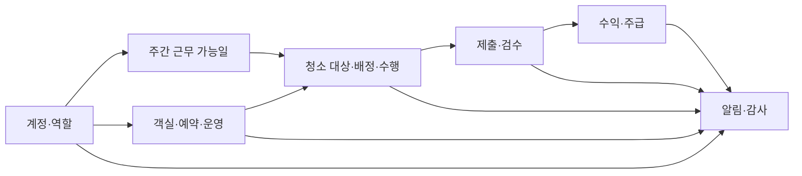

## 3. 계정·역할·근무 가능일

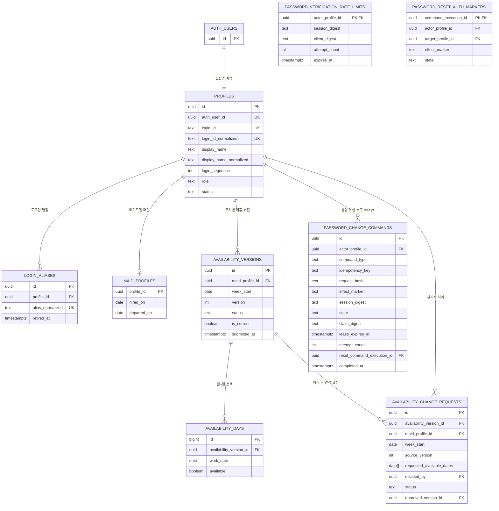

- `private.password_change_commands`는 `(actor, account.password.change, idempotency key)` 범위의 private receipt다. actor마다 미완료 행 하나만 허용하고 Auth mutation claim을 직렬화한다. 시작한 live session은 domain-separated SHA-256 digest로 결합해 같은 actor의 다른 세션 takeover를 막으며 raw session ID는 저장하지 않는다. 비밀번호 원문·변환값·hash/HMAC/verifier·token은 저장하지 않는다. `private.auth_password_versions`는 `auth.users.encrypted_password`가 실제로 바뀔 때만 최소 trigger가 회전하는 무작위 nonsecret version 원장으로 Auth hash나 파생값을 저장하지 않는다. 응답 유실 복구는 receipt `effect_marker`와 이 private version, 재전송된 새 비밀번호가 모두 일치할 때만 완료한다. `private.password_verification_rate_limits`는 actor당 한 행으로 모든 password probe를 제한하고, `private.password_reset_auth_markers`는 외부 Auth reset 성공과 exact private version 확인 후에만 inconsistent receipt를 supersede하는 command evidence다.

핵심 제약:

- 역할은 singleton `developer`와 복수 `admin | maid`다. developer는 계정 관리만 하고 일반 업무 capability는 active admin이 가진다.
- 최소 한 명의 활성 관리자는 항상 남겨야 한다.
- 활성 메이드만 근무 가능일을 제출할 수 있다.
- `(maid_profile_id, week_start, version)`은 유일하고, 주차별 현재 제출 버전은 한 건이다.
- version은 7개 날짜 row를 명시적으로 가지며, 새 제출·승인 version이 생겨도 이전 version과 날짜는 삭제하지 않는다.
- 일요일 12:00–23:59 KST의 일반 제출은 `expectedVersion` CAS와 idempotency key로 직렬화한다.
- 마감 뒤 변경은 pending 요청을 만들고 활성 관리자의 승인 시에만 새 current version으로 전환한다.
- 메이드 후보 목록은 `활성 계정 + 활성 maid 역할 + 해당 날짜 available`을 모두 만족해야 한다.

## 4. 객실·예약·운영

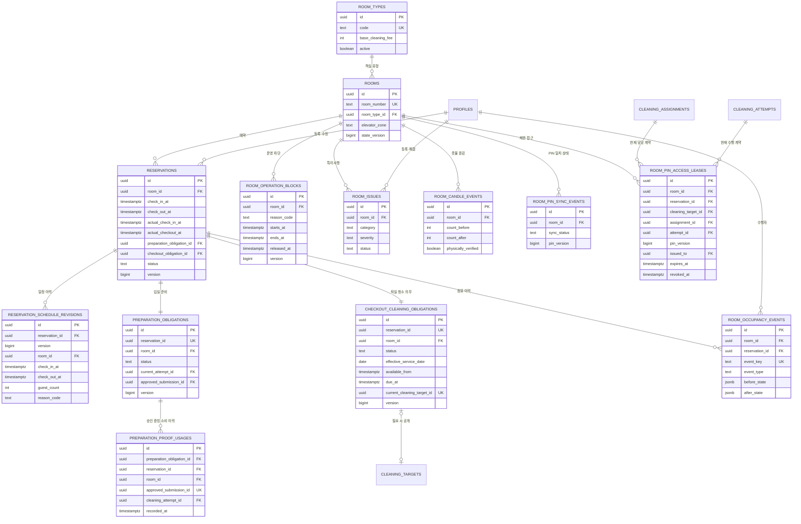

핵심 제약:

- 활성 예약 구간은 `[check_in_at, check_out_at)` 반개구간이며 GiST exclusion으로 객실별 겹침을 막는다. KST 날짜가 다음 날 이상이고 분 단위인 일정만 허용한다.
- 예약마다 입실 준비 의무와 비공개 퇴실 청소 의무를 정확히 하나씩 만든다. 퇴실 청소 대상은 필요 시 같은 의무에서 한 번만 공개한다.
- 퇴실 의무와 checkout target은 예약·객실·의무 ID 복합키와 deferred constraint trigger로 commit 시점까지 양방향 동일성을 강제한다. `completed`는 동일 target의 승인 근거가, `cancelled`의 historical pointer는 동일 target의 취소 상태가 있어야 한다.
- 입실 준비 `approved`는 같은 current attempt가 승인 상태이고, target 접근 가능 시각 이후 `시작 → 현장 완료 → 종료 → 제출 → 승인` 순서가 직전 점유 종료 이후·해당 체크인 이전에 같은 객실에서 완결됐음을 요구한다. `private.preparation_proof_usages`는 submission 소비를 append-only·전역 unique로 기록해 무효화 뒤에도 다른 예약에서 재사용하지 못하게 한다.
- 예약 일정, 점유, 촛불, PIN 동기화 이력은 append-only다. 예약·객실 current row는 CAS version으로만 갱신한다.
- 예약 취소는 입실 전에만 soft cancel한다. 수동 체크아웃은 예정 일정을 덮어쓰지 않고 실제 시각과 점유 event를 추가한다.
- 연박·추가 청소 요청은 `cleaning_targets`의 안정적인 ID와 `stayover_request`/`manual_room_request` source로 생성한다. 실제 초과 점유와 자정을 넘는 access window까지 interval로 충돌 검사하고, 시작 또는 PIN 공개 전까지만 CAS version으로 soft cancel하며 대상·담당·수행 이력은 삭제하지 않는다.
- 고객명 암호문은 예약에만 존재하고 목록 projection에서는 제외한다. 관리자 단건 상세에서만 복호화하며 체크아웃/취소 후 180일 보존 만료 시 암호문만 제거한다.
- 고객 배정에는 PIN 동기화 `verified`와 객실 기준정보 확인을 포함한 독립 readiness 조건을 모두 요구한다. PIN 원문은 이 ERD의 일반 업무 테이블에 저장하지 않는다.
- PIN lease는 target·현재 assignment·현재 attempt·담당 메이드·최신 verified PIN version을 함께 고정하며 다른 객실/예약/과거 담당을 조합할 수 없다. PIN version이 바뀐 뒤 수동 checkout은 stale lease를 revoke-only하고 최신 version으로만 새 lease를 만든다.
- 퇴실점검 lifecycle은 아직 `[미확정]`이므로 `checkout_inspections`를 구현된 목표 테이블처럼 두지 않는다.

## 5. 청소 배정·수행·검수

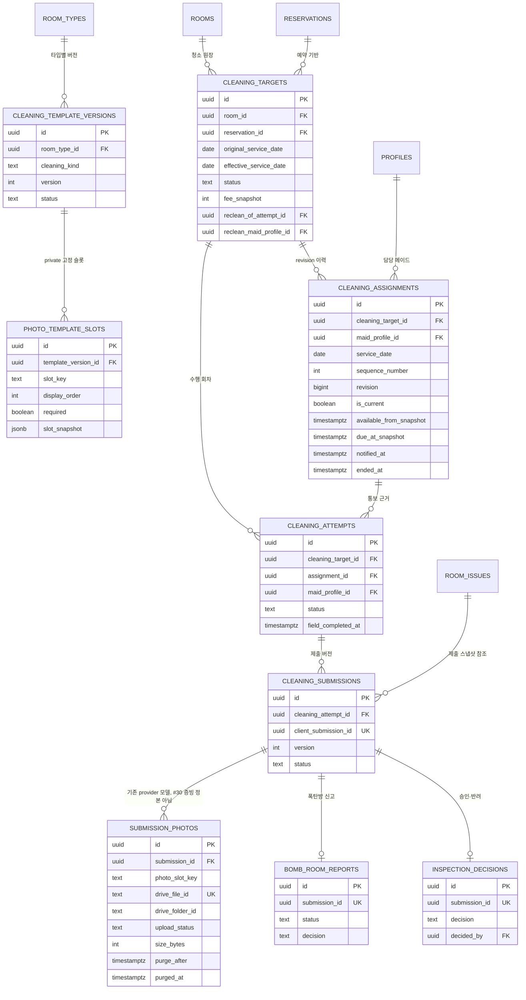

핵심 제약:

- 같은 객실의 서로 다른 미래 예약은 각각 checkout 청소 대상을 가질 수 있다.
- 같은 예약의 예정/수동 checkout은 합쳐서 청소 대상 한 건이며 `source_key` 재시도도 한 건으로 수렴한다.
- 예약 생성 시 obligation의 `planned_cleaning_target_id`가 정확히 하나의 checkout target을 참조한다. private 의무와 배정 계획은 별개 lifecycle 축이며 current pointer는 실제 checkout 전 null이다.
- 예약 객실 변경 command는 reservation·checkout obligation·동일 planned target의 `(reservation_id, room_id)` 복합 FK를 transaction commit에서 함께 검증한다. FK는 `DEFERRABLE INITIALLY DEFERRED`이지만 비활성화되지 않으며 반쪽 update는 `CHECKOUT_PLANNED_CONTRACT_NOT_ATOMIC`으로 실패한다. 미통보 draft는 stale로 남고 과거 notified 객실 snapshot은 변경하지 않는다.
- 오늘/내일 계획 배정·통보는 가능하지만 checkout attempt/PIN은 materialized current target과 실제 checkout/access 시각 검증을 통과해야 한다. #28만 attempt 활성화를 소유한다.
- 실제 checkout은 같은 planned target을 current로 승격한다. 조기 수동 퇴실은 schedule/assignment revision, 미통보 예약 변경은 draft stale로 처리한다. 통보 후 같은 객실의 퇴실 연장은 미착수·PIN/offline lease 미발급일 때만 immutable schedule/assignment replan을 허용하고, 그 외에는 stable conflict로 전체 롤백한다. 취소는 soft cancel/current 종료/회수 알림으로 처리한다.
- 작업마다 현재 배정은 최대 한 건이고, 과거 revision은 삭제하지 않는다.
- 현재 배정의 `(maid, service_date, sequence_number)`는 유일하다. 같은 순서는 메이드나 서비스 날짜가 다를 때만 재사용한다.
- 배정 revision은 생성 시 target의 `effective_service_date`, `available_from`, `due_at`을 snapshot으로 고정하고 target·maid·순서·revision·snapshot·변경자·생성시각을 이후 수정하지 않는다.
- #25 draft 저장은 `unassigned|draft_assigned` target만 row lock 후 `assignment_version` CAS로 갱신하며, 알림·outbox·attempt는 만들지 않는다.
- #26 commit은 KST 오늘/내일의 선택 draft만 최신 일정·active maid·current availability version과 다시 대조한다. 선택 부분집합은 전부 성공하거나 전부 롤백한다.
- 알림 확정 성공은 target/assignment, 수신자 notification, private persistent outbox, `assignment.notified` 감사를 같은 transaction에 기록한다. 외부 push와 cleaning attempt는 이 transaction에서 만들지 않는다.
- attempt는 assignment의 target·maid·revision과 모두 일치해야 하며, submission·earning의 maid도 같은 수행자를 가리킨다.
- #28 scheduler는 오늘 notified current assignment의 일정·active maid·source 조건을 다시 확인한 뒤 `scheduled` attempt를 exactly-once 만든다. attempt의 target/assignment/maid/revision/template/room snapshot은 생성 뒤 불변이다.
- 미래 planned checkout은 obligation materialization·current pointer·actual checkout 전 attempt 0이다. 같은 객실의 이전 active workflow가 있으면 target/assignment를 유지하고 활성화만 보류한다.
- 실행 창이 끝난 unassigned/notified attempt-0 target은 같은 ID/original date로 다음 KST 날짜에 이월한다. effective date/carryover/assignment version과 schedule revision만 증가하며 active attempt는 이월 대상이 아니다.
- 이월 write 전에 다음 source window를 검증한다. 연박은 active·실제 입실·미퇴실·동일 객실 예약 점유 범위/KST 날짜가 유효해야 하며, 추가 청소는 active reservation과 다음 창이 겹치지 않아야 한다. invalid면 blocked/mutation 0이며 기존 notified assignment/알림을 유지한다. 자동 취소·종류 변환은 하지 않는다.
- 검수 반려 재청소는 생성 뒤에도 원 attempt·원 maid 링크를 변경할 수 없고 다른 메이드에게 배정할 수 없다.
- 메이드마다 `in_progress` 수행 회차는 최대 한 건이다.
- #7A `cleaning_attempts.execution_version`은 양수 CAS version이다. 시작/물리 완료는 해당 회차와
  본인 current notified assignment identity/revision을 확인하고 한 번 증가하며 receipt replay는
  증가하지 않는다. field_completed는 사진/submission/검수/ready/earning과 별도 축이다.
- #7B 전 일반 role/status 변경으로 in_progress 수행자가 고립되지 않도록 DB guard로 거부한다.
  제한 capability/인계/offline lease는 별도 후속이며 active/session 경계를 완화하지 않는다.
- 제출은 `client_submission_id`로 멱등 처리하며, 수행 회차별 현재 제출은 한 건이다.
- 사진 파일은 비공개 Google Drive 폴더에만 저장하고 DB에는 Drive 파일 ID·해시·크기·삭제예정일·삭제 결과만 둔다.
- `purge_after`는 서버가 `uploaded_at + 7일`로 강제하며, 삭제 작업이 Drive 파일을 영구삭제한 뒤 `purged_at`을 기록한다.
- 템플릿과 슬롯은 **target 생성 시** 고정하고 attempt가 같은 계약을 사용한다. 제출에서는 그 슬롯의 특정 사진 버전 연결만 봉인하여 이후 교체가 과거 검수에 소급되지 않게 한다.

### #30 사진 슬롯·제출 버전 모델

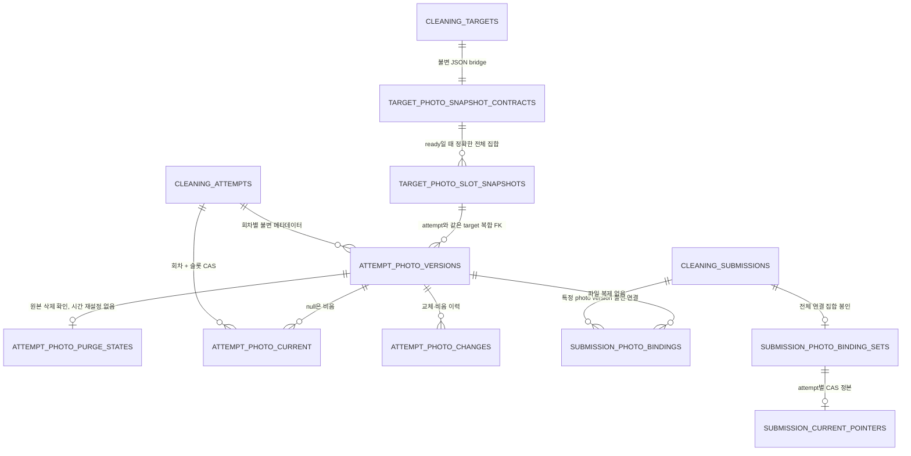

- 새 사진 모델 10개 테이블은 모두 `private` + RLS이며 `PUBLIC/anon/authenticated/service_role`의 읽기·직접 DML 권한이 없다. 모델 helper도 owner-only다. #9/#31의 세션·실제 파일 검증 경로가 생기기 전 사진/제출 HTTP는 추가하지 않는다.
- 기존 `cleaning_template_versions.photo_slots`, `cleaning_targets.template_snapshot`, `cleaning_attempts.template_snapshot`은 제거하지 않는다. 새 슬롯 row는 `slot_snapshot`에 구역·이름·설명·반복 인스턴스를 포함한 정확한 원본 객체를 보존하고, 식별자·필수 여부·표시 순서는 정규화 컬럼으로 검증한다.
- 기존 v1 `[]` 또는 복원 근거가 없는 JSON은 `ready=false`다. 이 때문에 기존 예약/배정/물리적 완료가 막히지는 않지만 사진 완전성·제출 연결은 실패한다. 최신 템플릿으로 보간하거나 사진 0장을 완료로 인정하지 않는다. v6 명시 슬롯에는 v7 `tv-on`이나 개수를 소급하지 않는다.
- 새 v7+ checkout 템플릿은 타입별 10/11/13/15개, 그중 선택 1개와 필수 `tv-on` 정확히 1개를 검증한다. 연박/추가/재청소 운영 슬롯은 데모에서 seed하지 않는다. 최대 100개 슬롯·80자 key·0–99 표시 순서는 기술적 입력 상한이며 제품별 필수 사진 수를 뜻하지 않는다.
- 증빙 identity는 `(cleaning_attempt_id, cleaning_target_id, target_photo_slot_id, version)`이다. 구 담당자의 interrupted 사진과 새 담당자의 사진은 같은 target slot을 쓰더라도 서로 다른 current pointer를 가진다. NULL/다른 target/다른 attempt 연결은 복합 FK로 거부한다.
- `attempt_photo_versions`는 불변이다. `uploaded_at + 168시간` 만료는 교체·재제출·retry로 연장하지 않으며, 실제 provider 삭제 확인은 별도 append-only purge marker로 관리한다. #30에서 bytes/Drive 업로드나 삭제를 실제 수행하지 않는다.
- 필수 슬롯이 전부 verified·미만료·미삭제 사진을 가져야 한다. 선택 슬롯은 비어 있어도 되지만 선택된 current 사진이 pending/failed/만료/삭제 상태이면 완전하지 않다. frozen JSON과 normalized 슬롯의 전체 집합도 다시 대조한다.
- `cleaning_submissions`가 계속 제출 버전 정본이다. 미소비 제출도 identity/manifest/업무 snapshot/제출자·시각은 수정·삭제할 수 없고 `status/superseded_at`만 기존 lifecycle projection으로 남긴다. `submission_photo_binding_sets`는 정본을 복제하는 제출 테이블이 아니라 연결 봉인 marker다.
- 봉인 시 현재 photo set과 양방향 동일성을 검증하고, 이후 membership INSERT/UPDATE/DELETE를 금지한다. 사진 교체와 연결은 같은 attempt lock에서 직렬화한다. current pointer는 CAS로 바뀌지만 과거 제출의 특정 photo version은 유지된다.
- #30 단계 자체는 모델 연결까지만 소유했으며, #31의 후속 append-only migration이 business 전체제출·검수·수익·재청소 명령을 연결한다. canonical `cleaning_submissions` 및 legacy `submission_photos`에 대한 service-role raw DML 차단은 계속 유지한다. legacy manifest/default `uploaded`만으로 verified 증빙을 만들지 않는다.

### #31 전체 제출·폭탄방·검수·재청소 원장

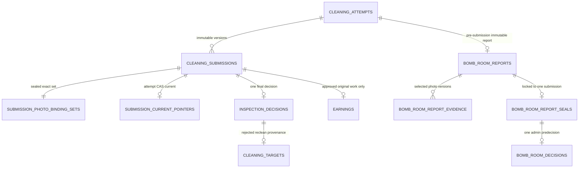

- `private.bomb_room_reports/evidence/seals/decisions`는 RLS와 direct DML revoke가 적용된 append-only 원장이다. 신고는 정확한 본인 attempt와 selected verified photo version 1~20개를 묶고, 최초 full submission에서 한 번 seal된 memo/evidence를 다른 submission version으로 이동하지 않는다.
- submission current pointer는 attempt별 revision CAS다. field completion만으로 제출/검수/earning은 생기지 않으며, 필수 current photo가 하나라도 누락·pending·failed·expired·purged면 새 제출을 거부한다. 일반 재제출은 과거 version/photo bindings를 immutable history로 남긴다.
- 관리자 검수 queue/detail은 current `inspection_pending`만 사용한다. queue의 roomNumber는 target/live room이 아니라 notified assignment snapshot에서 가져오며, sealed photo ID/slot/version 외 provider locator/hash/file name과 PIN/PII/request hash/raw state는 반환하지 않는다.
- stale current review와 bomb 선판정은 `STALE_VERSION`으로 실패한다. 최종 approve/reject, notification/outbox/audit, earning 또는 reclean 생성은 한 transaction이며 receipt lock과 unique provenance로 동시 재시도를 exactly-once 처리한다.
- 승인 earning은 유상 원청소에만 submission/entitlement identity로 한 건이며 approved bomb bonus는 frozen base와 같다(0원 base도 0원 provenance 허용). 반려는 earning 없이 원 attempt/submission/decision·원 maid에 묶인 0원 `inspection_reclean` target과 notified assignment를 만든다. attempt 생성은 기존 #28 activation만 소유하고 다른 maid 이관은 금지한다.
- checkout completion은 root target status만 신뢰하지 않는다. `completion_submission_id`에서 승인된 terminal descendant를 recursive reclean chain으로 증명하며, 새 completed obligation에 NULL submission proof를 허용하지 않는다.

### #27 시작 전 취소 요청 원장

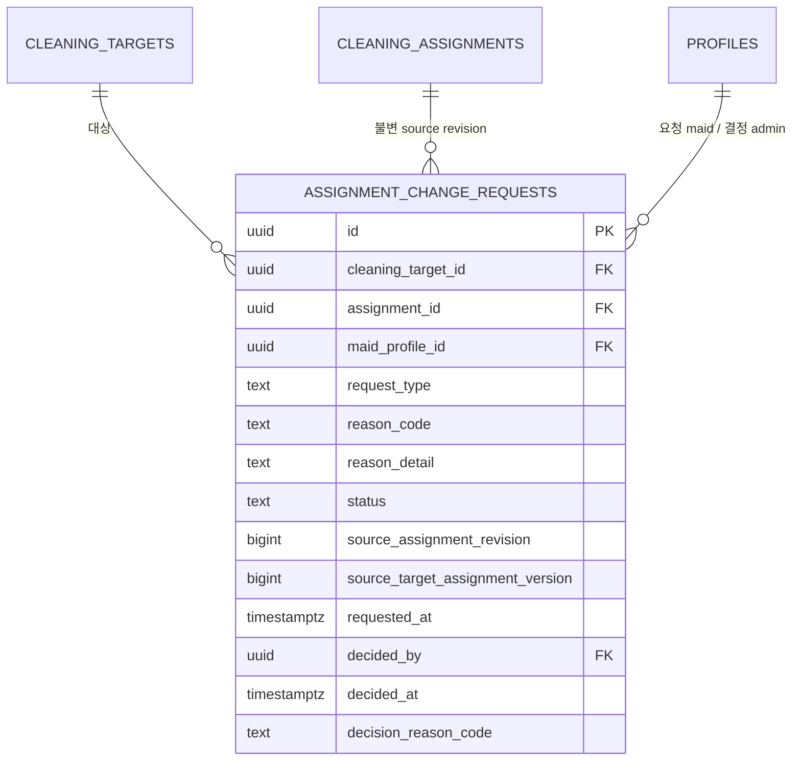

- assignment/target/maid/revision 복합 FK, assignment당 pending 최대 1건. source와 terminal decision은 불변이고 DELETE 금지다.
- pending → approved/rejected 또는 source 종료 시 superseded. source stale 요청으로 새 assignment를 해제할 수 없다.
- RLS는 active admin 전체/maid 본인만, developer 0. 직접 INSERT/UPDATE/DELETE와 client RPC 실행은 차단한다.
- pre-start 변경/해제/요청/결정은 non-superseded attempt가 있으면 전부 거부한다. current assignment ID + target version CAS와 공통 잠금으로 activation 경합에서 한쪽만 성공한다.
- schedule 축소는 `manual_room_request + additional` 또는 `stayover_request + stayover`만 허용한다. stayover는 actual check-in된 active reservation과 target의 reservation/room 일치 및 checkout 이전 점유 구간을 재검증한다. 다른 source-kind 조합과 날짜 이동·창 확장은 거부한다.
- notified 변경/해제는 기존 notification을 보존/resolve하고 새 알림/outbox를 추가한다. draft에는 통보가 없다. reason detail은 audit/notification에 포함하지 않는다.
- request 조회는 31일/100건 상한과 requested_at/id cursor, maid/target/assignment/decider FK indexes를 사용한다.

## 6. 수익·주급·알림·감사

알림은 삭제하지 않으며 recipient/category/title/body/room/target/dedupe/group/action/발생·생성 시각을
수정하지 않는다. `read_at`은 본인 markRead command가 DB 시각으로 NULL에서 한 번만 채우고,
`resolved_at`은 기존 도메인 SECURITY DEFINER command가 NULL에서 한 번만 채운다. raw Data API는
SELECT/UPDATE를 제공하지 않으며 RLS도 관리자 포함 exact recipient만 허용한다. 알림함 index와 cursor는
`(recipient_profile_id,occurred_at DESC,id DESC)` 순서를 사용한다.

#109/#128의 typed 알림은 private event catalog의 48 event family/32 public category를 정본으로
삼는다. `source_entity_*`, actor, recipient capability, room/target, deep-link UUID를 생성 즉시
검증하고 exact terminal evidence만 actionable notice를 resolve한다. recipient별 logical event
dedupe와 그룹은 분리된다. `notification_groups`는 `(recipient,groupFamily,scope)`별 첫
event에 고정된 10분 half-open window와 비민감 UUID `groupId`를 보존한다.
inactive/임시 비밀번호/self-action도 inbox에는 남지만 typed delivery outbox에는 넣지 않는다.
`push_eligible`은 `requires_action`과 독립이며 informational 취소·회수·결정, 현장 완료, exact
예약/객실 card-impact 변경도 active 타 수신자에게 push할 수 있다. 상세 표는 [알림 이벤트 카탈로그](./NOTIFICATION_CATALOG.md)다.

#110의 Web Push 구독은 `private.web_push_subscriptions` logical/current projection,
`web_push_subscription_revisions` immutable revision metadata,
`web_push_subscription_secrets` current AES-256-GCM envelope,
`web_push_subscription_events` 최소 lifecycle 및 `web_push_registration_limits`로 분리한다.
Auth session UUID는 metadata column에 평문 저장하지 않고 current encrypted envelope에만 포함해
후속 #111 claim이 send 직전 live session을 재검증할 수 있게 한다.
active endpoint digest는 전역 1개, `(profile,session digest)`는 1개이고 profile당 active 5개를
profile lock으로 직렬화한다. rotation/retire CAS 때 이전 secret은 같은 transaction에서 삭제되며
revision은 90일 metadata retention 대상이다. event에는 subscription UUID/reason/server time만 남는다.
모든 private table은 RLS와 raw grant deny이고 service-only RPC가 live Auth session을 다시 검증한다.

#112의 45번째 append-only migration은 `web_push_subscription_revisions.vapid_key_version`을 추가한다.
새 registration/rotation revision은 서버 current VAPID version을 같은 transaction에서 반드시 기록하고,
immutable guard가 이후 변경을 금지한다. 기존 revision의 NULL은 legacy-unbound provenance로 보존하며 current
version으로 backfill하거나 추측하지 않는다. delivery context는 exact target revision의 binding만 반환하고
NULL이면 `VAPID_KEY_UNBOUND` dead-letter로 push를 종결한다. 공개 config API는 key version, public P-256
point와 10분 actor/session-bound opaque proof만 노출한다. register는 proof가 인증한 key version을 immutable
revision과 request hash에 사용하며 current를 추측하지 않는다. private scalar, endpoint/envelope/session/digest는
계속 private 원장 밖으로 나오지 않는다.

#111은 immutable `notification_delivery_outbox`를 job intent로 보존하고
`notification_delivery_jobs` → exact `notification_delivery_targets` → append-only
`notification_delivery_attempts`/`notification_delivery_attempt_results` 및
`notification_delivery_permits`로 전송 상태와 외부 호출 경계를 분리한다. target은 최초 fanout 때의
subscription ID/version/revision을 바꾸지 않으며 secret envelope를 복제하지 않는다. mutable job/target은
terminal resurrection과 임의 DELETE가 금지되고, append-only attempt/result/event는 terminal 후 90일
bounded purge RPC만 허용한다. heartbeat는 비민감 포화 count와 safe reason만 저장한다.

```mermaid
erDiagram
  CLEANING_SUBMISSIONS ||--o| EARNINGS : "승인 후 1회 적립"
  EARNINGS ||--o{ COMPLAINT_CASES : "승인 후 30일 접수"
  COMPLAINT_CASES ||--o{ COMPLAINT_DECISIONS : "판정·정정 version"
  COMPLAINT_CASES ||--o| COMPLAINT_MAID_RESPONSES : "최초 판정 1회 응답"
  COMPLAINT_CASES ||--o{ COMPLAINT_CASE_EVENTS : "수명주기 원장"
  COMPLAINT_CASES ||--o| COMPLAINT_COMPENSATION_DECISIONS : "재작업 확정"
  COMPLAINT_COMPENSATION_DECISIONS ||--|| CLEANING_TARGETS : "typed complaint reclean"
  COMPLAINT_COMPENSATION_DECISIONS ||--o| COMPENSATION_ENTITLEMENTS : "타 maid 승인 근거"
  COMPENSATION_ENTITLEMENTS ||--|| EARNINGS : "typed compensation source"
  PROFILES ||--o{ EARNINGS : "메이드 수익"
  PROFILES ||--o{ PAYROLL_CYCLES : "메이드별 주차"
  PAYROLL_CYCLES ||--o{ PAYROLL_ITEMS : "잠금 원장"
  EARNINGS ||--o{ PAYROLL_ITEMS : "지급 포함"
  PAYROLL_CYCLES ||--o{ PAYROLL_EVENTS : "지급 상태 이력"
  PAYROLL_CYCLES ||--o{ PAYROLL_ADJUSTMENTS : "완료 후 정정"
  PROFILES ||--o{ NOTIFICATIONS : "수신자"
  NOTIFICATION_EVENT_CATALOG ||--o{ NOTIFICATIONS : "typed event"
  NOTIFICATION_GROUPS ||--o{ NOTIFICATIONS : "fixed 10m group"
  NOTIFICATIONS ||--o| NOTIFICATION_DELIVERY_OUTBOX : "typed push input"
  NOTIFICATION_DELIVERY_OUTBOX ||--|| NOTIFICATION_DELIVERY_JOBS : "immutable intent companion"
  NOTIFICATION_DELIVERY_JOBS ||--o{ NOTIFICATION_DELIVERY_TARGETS : "first fanout snapshot"
  WEB_PUSH_SUBSCRIPTION_REVISIONS ||--o{ NOTIFICATION_DELIVERY_TARGETS : "exact revision binding"
  NOTIFICATION_DELIVERY_TARGETS ||--o{ NOTIFICATION_DELIVERY_ATTEMPTS : "max 8 fenced attempts"
  NOTIFICATION_DELIVERY_ATTEMPTS ||--o| NOTIFICATION_DELIVERY_PERMITS : "send linearization"
  NOTIFICATION_DELIVERY_ATTEMPTS ||--o| NOTIFICATION_DELIVERY_ATTEMPT_RESULTS : "provider-neutral result"
  PROFILES ||--o{ WEB_PUSH_SUBSCRIPTIONS : "own active max 5"
  WEB_PUSH_SUBSCRIPTIONS ||--o{ WEB_PUSH_SUBSCRIPTION_REVISIONS : "immutable CAS revisions"
  WEB_PUSH_SUBSCRIPTION_REVISIONS ||--o| WEB_PUSH_SUBSCRIPTION_SECRETS : "current encrypted envelope"
  WEB_PUSH_SUBSCRIPTIONS ||--o{ WEB_PUSH_SUBSCRIPTION_EVENTS : "minimal lifecycle"
  PROFILES ||--o{ AUDIT_EVENTS : "행위자"
  PROFILES ||--o{ ACTOR_ACTIVITY_EVENTS : "인증·권한·민감접근 행위자"
  PROFILES ||--o{ ACTOR_AUTHORIZATION_DENIAL_AGGREGATES : "권한 거부 집계 행위자"
  PROFILES ||--o{ SCHEDULER_INVOCATION_HEARTBEATS : "scheduler actor"
  PROFILES ||--o| DEVELOPER_DIAGNOSTIC_RATE_LIMITS : "진단 제한"

  EARNINGS {
    uuid id PK
    uuid earning_entitlement_id FK
    uuid compensation_entitlement_id FK
    uuid submission_id UK
    uuid maid_profile_id FK
    date earned_on
    int base_amount
    int bomb_room_bonus
  }
  COMPLAINT_CASES {
    uuid id PK
    uuid room_id FK
    uuid cleaning_target_id FK
    uuid cleaning_attempt_id FK
    uuid submission_id FK
    uuid inspection_decision_id FK
    uuid original_earning_id FK
    uuid maid_profile_id FK
    text category
    text status
    bigint version
    uuid current_decision_id FK
    uuid current_compensation_decision_id FK
  }
  COMPLAINT_DECISIONS {
    uuid id PK
    uuid complaint_case_id FK
    int decision_version
    uuid prior_decision_id FK
    text finding
    int penalty_score
    boolean rework_required
  }
  COMPLAINT_MAID_RESPONSES {
    uuid id PK
    uuid complaint_case_id FK,UK
    uuid decision_id FK
    text response_type
    text appeal_reason_code
  }
  COMPLAINT_CASE_EVENTS {
    bigint id PK
    uuid complaint_case_id FK
    text event_type
    bigint case_version
  }
  COMPLAINT_COMPENSATION_DECISIONS {
    uuid id PK
    uuid complaint_case_id FK,UK
    uuid complaint_decision_id FK,UK
    uuid original_cleaning_target_id FK
    uuid rework_cleaning_target_id FK,UK
    uuid original_maid_profile_id FK
    uuid assignee_maid_profile_id FK
    int original_base_fee_snapshot
    int compensation_amount
    text currency
  }
  COMPENSATION_ENTITLEMENTS {
    uuid id PK
    uuid compensation_decision_id FK,UK
    uuid rework_cleaning_target_id FK,UK
    uuid maid_profile_id FK
    uuid cleaning_attempt_id FK,UK
    uuid submission_id FK,UK
    uuid inspection_decision_id FK,UK
    int amount
  }
  PAYROLL_CYCLES {
    uuid id PK
    uuid maid_profile_id FK
    date week_start
    text status
    int locked_amount
    bigint version
  }
  PAYROLL_ITEMS {
    uuid id PK
    uuid payroll_cycle_id FK
    uuid earning_id FK,UK
    uuid maid_profile_id FK
    int locked_amount
  }
  PAYROLL_EVENTS {
    bigint id PK
    uuid payroll_cycle_id FK
    text event_type
    uuid actor_profile_id FK
  }
  PAYROLL_ADJUSTMENTS {
    uuid id PK
    uuid payroll_cycle_id FK
    int amount
    text reason_code
  }
  NOTIFICATIONS {
    uuid id PK
    uuid recipient_profile_id FK
    text category
    text event_family FK
    text source_entity_kind
    text source_entity_id
    text deep_link_kind
    uuid deep_link_entity_id
    uuid notification_group_id FK
    timestamptz read_at
    timestamptz resolved_at
  }
  NOTIFICATION_EVENT_CATALOG {
    text event_family PK
    text category
    text recipient_capability
    text resolver_kind
  }
  NOTIFICATION_GROUPS {
    uuid id PK
    uuid recipient_profile_id FK
    text group_family
    uuid scope_id
    timestamptz started_at
    timestamptz ends_at
  }
  NOTIFICATION_DELIVERY_OUTBOX {
    uuid id PK
    uuid notification_id FK
    text event_family FK
    text delivery_status
  }
  AUDIT_EVENTS {
    uuid id PK
    uuid actor_profile_id FK
    text event_type
    text entity_type
    uuid entity_id
    text idempotency_key UK
  }
  ACTOR_ACTIVITY_EVENTS {
    uuid id PK
    uuid actor_profile_id FK
    text actor_role_snapshot
    text category
    text event_type
    text outcome
    text source
    text reason_code
    text request_id
    timestamptz occurred_at
    timestamptz recorded_at
  }
  ACTOR_ACTIVITY_AGGREGATES {
    uuid id PK
    timestamptz bucket_started_at
    text event_type
    int occurrence_count
    timestamptz last_occurred_at
  }
  ACTOR_AUTHORIZATION_DENIAL_AGGREGATES {
    uuid id PK
    uuid actor_profile_id FK
    text actor_role_snapshot
    text source
    text reason_code
    timestamptz bucket_started_at
    int occurrence_count
    timestamptz first_occurred_at
    timestamptz last_occurred_at
  }
  SCHEDULER_INVOCATION_HEARTBEATS {
    text invocation_key PK
    timestamptz scheduled_at
    uuid actor_profile_id FK
    text status
    int transition_count
    int attempt_count
    timestamptz last_completed_at
  }
  DEVELOPER_DIAGNOSTIC_RATE_LIMITS {
    uuid actor_profile_id PK,FK
    timestamptz window_started_at
    int attempt_count
  }
```

- `payroll_items`는 cycle이 `OPEN`인 잠금 transaction에서만 추가하며 earning의 `earned_on`이 cycle의 월요일 시작 7일 구간에 속해야 한다.
- #96 조회는 `earnings(maid_profile_id, earned_on, id) INCLUDE(total_amount)` index와 source-controlled 오름차순 keyset을 사용한다. cycle page는 최대 10, nested preview는 각 10, 상세 item/lateEarning page는 최대 50이며 DB RPC가 상한을 독립 강제한다. count/amount는 preview가 아니라 전체 집합의 정확한 값이다.
- cycle이 `PAYING`에 진입한 뒤에는 item membership과 잠금 금액·행위자·시각 snapshot을 임의로 바꿀 수 없다. 외부 송금이 없음을 확인한 `PAYING/CHECK → OPEN`은 사유·행위자·시각과 CAS version을 기록하면서 lock metadata만 해제하며 candidate item은 유지한다. `PAID` snapshot은 되돌려 쓰지 않는다.
- scheduler heartbeat, developer 진단 제한, actor activity 원본은 `private` 운영 projection 상태다. Data API table 권한을 주지 않고 service-role도 원본 table을 직접 읽지 않으며, exact developer/admin 검증을 포함한 app-owned RPC로만 기록·조회한다.
- developer 감사 API는 `audit_events`의 raw JSON을 반환하지 않고 account·availability·reservation·cleaning·room domain event allowlist의 필드별 projection만 최대 31일·100건 cursor pagination으로 반환한다.
- 로그인·민감접근은 domain audit과 분리해 `actor_activity_events`에 append하며 저장 request ID는 server-generated UUID v4만 허용한다. unknown login 실패는 로그인 ID·IP·HMAC 없이 `actor_activity_aggregates`의 분 단위 한 row로, 권한거부는 `(actor, source, reason, UTC minute)`별 `actor_authorization_denial_aggregates` 한 row로 유지하고 두 count 모두 600에서 포화한다.

`20260909215829_payroll_bounded_pagination.sql`은 #93까지의 35개 migration을 수정하지 않는 36번째
append-only feature migration이다. 새 table/column은 만들지 않고 earnings 조회 index와 bounded
service-role projection RPC만 추가·교체한다. production/recovery 적용 상태는 이 source 변경과 별개다.

`20260910003054_complaint_lifecycle.sql`은 기존 36개 migration을 수정하지 않는 37번째 append-only feature
migration이다. complaint source identity 7개는 모두 실제 FK이며 임의 polymorphic UUID를 사용하지 않는다.
원 target은 현재 original-cleaning source allowlist에 속하고 earning entitlement가 승인 submission과 non-null로
정확히 같아야 하므로 reclean·향후 alternate compensation source는 fail-closed다. case만 CAS projection으로
갱신하고 decision/maid response/event는 불변이다. 공개 table은 RLS를 켜고 SELECT에도 동일 사용자의 live
`auth.sessions` JWT session을 요구하며 authenticated direct write와 privileged RPC 실행을 막고 app-owned
service-role RPC만 command를 수행한다.

`20260910035941_complaint_compensation_earning.sql`은 기존 37개 migration을 수정하지 않는 38번째
append-only feature migration이다. `post_approval_complaint_reclean`은 최초 검수 반려의
`inspection_reclean`과 섞이지 않으며 confirmed current complaint decision, 원 target/base fee, active assignee,
published reclean template, target/version/notified assignment revision을 한 admin CAS command로 고정한다.
server가 현재 점유·다음 check-in·기존 active target·maid availability를 이용해 안전한 당일 접근 창을 증명하지
못하면 materialize 전체가 실패하고 client schedule은 받지 않는다. 같은 maid는 amount 0 decision만 남기고
entitlement/earning을 만들지 않는다. 다른 maid는 현장 완료와 current submission 승인 뒤 0원도 포함해 exact
typed `compensation_entitlements`와 `earnings.compensation_entitlement_id`를 각각 한 건 만든다. earnings의
원청소/보상 FK exactly-one CHECK는 기존 원청소 identity를 backfill 없이 보존한다. pre-start semantic correction은
ghost assignment를 남기지 않도록 차단하고 penalty-only correction은 실행 가능하다. 시작 뒤 correction은
operational source decision을 덮어쓰지 않으며 admin projection이 current/source divergence를 표시한다. raw
compensation decision Data API는 live-session business admin만 읽고 maid projection은 서로의 profile ID와
타인의 보상액을 숨긴다. 이 source 후보는 production/main/recovery에 적용되지 않았다.

`20260910071812_payroll_adjustments.sql`은 기존 38개 migration을 수정하지 않는 39번째 append-only feature
migration이다. maid별 `payroll_adjustment_books` CAS가 signed correction/reversal/late carry 순서를 고정하고,
`payroll_adjustments`의 five-way typed source CHECK와 unique reversal/late source가 임의 polymorphic provenance와
중복을 막는다. reversal은 source 전액의 exact inverse이며 root earning 누적액은 0 미만이 될 수 없다.

`payroll_adjustment_items`와 기존 earning item은 OPEN cycle이 claim한 immutable snapshot이다.
`payroll_offset_settlements`는 net 0 이하 candidate를 payment event 없이 경제적으로 동결하고,
`payroll_residual_carries`/`payroll_carry_items`는 음수 크기를 바로 다음 KST 주차로 한 칸씩 exactly-once 전달한다.
net 0에는 carry row가 없다. PAID/offset-settled cycle의 late earning은 unique `late_carried_earning_id`를 가진
positive adjustment로 다음 주차에만 옮기며 원 earning은 보존되고 다시 payroll item으로 claim되지 않는다.
여섯 public table 모두 authenticated SELECT에 live session과 admin/maid-self를 요구하고 direct DML 및
service-role raw table 권한은 없다. production/main/recovery 적용 상태와 무관한 source 후보 schema다.

`20260910114525_payroll_payment_results.sql`은 기존 39개 migration을 수정하지 않는 40번째 append-only
feature migration이다. `payroll_payment_attempts`는 기존 `payment_started` event와 cycle/maid/version/locked
amount/actor/time을 실제 FK와 trigger로 일치시키며, OPEN 복귀 뒤 다음 start는 증가하는 attempt identity를
만든다. 기존 event는 attempt까지만 deterministic backfill하고 증명되지 않은 과거 CHECK/PAID result는 만들지
않는다.

`payroll_payment_results`는 CHECK, PAID, NO_TRANSFER_CONFIRMED reopen을 immutable typed result로 보존한다.
PAID amount는 attempt의 양수 locked snapshot과 정확히 같고 `paid_at`은 server time이며 PAID cycle과 evidence는
수정·삭제·reopen할 수 없다. `bank_transfer` reference는 엄격한 ASCII allowlist를 uppercase canonicalize해
method와 함께 전역 unique로 묶는다. raw table은 live-session business admin만 읽고 maid/developer safe
projection에는 reference와 cross-maid amount를 노출하지 않는다. production/main/recovery 적용 상태와 무관한
source 후보 schema다.

## 7. Supabase Free Plan 전용 운영 기준

### #29 versioned duration policy (feature source)

`profiles`의 관리자 생성자·확정자는 `assignment_duration_policy_versions`의 FK로 보존한다.
정책은 target/assignment에 새 write pointer를 추가하지 않는다. Preview 응답의 policy version과
input fingerprint만 조회 시점의 입력을 식별하며, 실제 배정 snapshot 저장은 #25/#26 책임이다.

- `id`, 양수 unique `version`, `status = draft | confirmed | retired`
- `standard_minutes`, `premium_minutes`, `ocean_premium_minutes`, `ocean_family_minutes`: 모두 양수
- `created_by/created_at`, `confirmed_by/confirmed_at`; confirmed/retired는 확정자·시각 필수
- confirmed partial unique index로 현재 확정 정책 최대 한 건, FK 자식 index 두 개
- RLS 활성화·직접 SELECT/DML revoke; 관리자용 read/confirm RPC만 허용
- 기존 값 immutable, DELETE 금지; 기존 confirmed의 retired 전환 외 UPDATE 금지
- fresh confirmed 0건, 55/65/70/80 seed 없음, preview DML 0

실제 DDL 정본은 `20260907143843_assignment_preview_duration_policy.sql`이며 기존 24개
migration을 수정하지 않는다. 운영·recovery 적용 상태와 무관한 feature schema다.

2026-08-25 기준 공식 Free Plan 범위 안에서만 사용한다.

| 항목 | Free 한도 | 이 프로젝트 기준 |
|---|---:|---|
| 활성 프로젝트 | 최대 2개 | 운영 1개 + 최신 논리 백업 복구검증 1개, 유료 DB 브랜치 미사용 |
| Auth | 총 사용자 무제한, 월 활성 사용자 50,000명 | 관리자·메이드 수를 앱에서 고정하지 않음 |
| Database | 프로젝트당 500MB | 400MB 경고, 감사 JSON 크기 제한, 불필요한 중복 스냅샷 금지 |
| Storage | 조직당 1GB | 사진 파일 미사용, DB에는 Google Drive 메타데이터만 저장 |
| Egress | 5GB + cached 5GB | 사진 파일이 Data API·Storage를 통과하지 않으므로 사진 egress 미사용 |
| Realtime | 월 200만 메시지, 동시 200연결 | MVP 핵심 경로에는 미사용, 필요 화면만 제한 구독 |
| Edge Functions | 월 500,000회 | 초기 백엔드는 Fastify 서버 사용, 정리 작업만 필요 시 검토 |

사진은 프론트 앱에서 **최대 300KiB(307,200바이트)** JPEG/WebP로 압축하고 EXIF를 제거한 뒤 API에 전송한다. 백엔드는 `room-management-system-photos/YYYY-MM-DD/객실번호` 폴더를 찾아 만들고 비공개 Google Drive에 업로드한다. 날짜는 서비스 표준 시간대인 KST의 업로드 날짜를 사용하며, 중복 방지를 위해 실제 파일명에는 수행 회차·사진 슬롯·사진 UUID를 포함한다. Drive OAuth 토큰은 브라우저에 주지 않는다.

현재 121개 객실을 모두 하루에 한 번 청소하고 타입별 필수 슬롯 수(10·11·13·15장)를 그대로 적용하면 하루 최대 1,475장, 7일 보관량은 약 **3.17GB**다. 모든 객실에 가장 큰 15장 기준을 적용한 보수적 최악값도 하루 1,815장, 약 **3.90GB**다. Google 개인 계정 기본 15GB 중 20% 여유를 남긴 12GB를 사진에 쓴다고 보면 이론상 약 5,580장/일까지 가능하므로 객실 운영 최대치보다 충분하다. 단, 15GB는 Gmail·Drive·Google Photos 공유 용량이므로 전용 운영 계정을 쓰고 10GB에서 경고, 12GB에서 신규 업로드 차단과 관리자 알림을 적용한다.

각 사진의 `purge_after`는 폴더 날짜가 아니라 정확히 `uploaded_at + 7일`이다. 정리 작업은 주기적으로 만료 레코드를 잠그고 Drive `files.delete`를 호출해 휴지통을 거치지 않고 영구삭제한다. 성공 또는 이미 없는 파일(404)은 `purged`로 완료하고, 일시 오류는 지수 백오프로 재시도한다. 빈 객실·날짜 폴더는 그 안의 관리 대상 파일이 모두 삭제된 뒤 정리한다. 메타데이터·해시·검수 결과는 DB 감사 근거로 유지한다. 상세 규칙은 [사진 저장 운영안](./PHOTO_STORAGE.md)을 따른다.

Free 프로젝트는 낮은 활동이 7일 이어지면 일시 정지될 수 있고 공식 일일 백업 보장·PITR·DB branching·SLA가 없다. 마이그레이션 정본은 Git에 보관하고, 두 번째 Free 프로젝트에는 주기적으로 최신 논리 백업을 복원해 실제 복구 가능성을 검증한다. 구체적인 절차는 [백업·복구 운영안](./BACKUP_AND_RECOVERY.md)을 따른다.

공식 근거:

- [Supabase Pricing](https://supabase.com/pricing)
- [Supabase billing guide](https://supabase.com/docs/guides/platform/billing-on-supabase)
- [Supabase Free project pausing](https://supabase.com/docs/guides/platform/free-project-pausing)
- [Supabase Storage usage](https://supabase.com/docs/guides/platform/manage-your-usage/storage-size)
- [Google 계정 저장용량](https://support.google.com/drive/answer/6374270?hl=ko)
- [Google Drive 폴더 생성과 parents](https://developers.google.com/workspace/drive/api/guides/folder)
- [Google Drive 파일 영구삭제](https://developers.google.com/workspace/drive/api/guides/delete)

## 8. 무료 ERD 사이트에서 확인하기

전체 상세 스키마는 [`room-management-system.dbml`](./room-management-system.dbml)에 있다.

1. [dbdiagram.io](https://dbdiagram.io/)에서 새 다이어그램을 만든다.
2. `room-management-system.dbml` 내용을 붙여 넣는다.
3. 관계선을 이동해 원하는 배치로 정리하고 PNG/PDF로 내보낸다.

위 Mermaid 블록은 [Mermaid Live Editor](https://mermaid.live/edit)에서도 바로 확인할 수 있다.

## 9. 이후 반영 순서

### #85 개발 소스: 168시간 purge·orphan 보상·폴더 retirement

`20260908195510_photo_purge_reconciliation.sql`은 기존 32개 migration 뒤에 추가하는 feature migration이며 production 적용을 뜻하지 않는다.

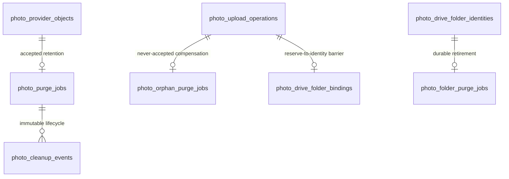

- accepted 사진은 DB가 정확히 `uploaded_at + 168 hours`를 due로 판정하고 만료 즉시 읽기 불가다. never-accepted candidate는 별도 orphan ledger로만 정리한다.
- 기존 및 신규 upload operation은 exact room-folder binding을 가진다. retirement가 시작되면 reserve/provider-success/finalize가 fail-closed하며, pending upload state 또는 identity가 있으면 folder retirement를 시작할 수 없다.
- Drive 삭제 `204/404`만 terminal success다. raw locator는 terminal settle 때 제거하고 private SHA-256 tombstone과 append-only cleanup event를 남긴다.
- room 폴더를 먼저 확인·삭제하고 모든 child가 terminal일 때 date 폴더를 처리한다. provider list emptiness만을 DB authority로 사용하지 않는다.
- private 원장에는 RLS가 켜져 있고 Data API/direct write grant가 없다. worker RPC는 fixed search path와 service-role-only EXECUTE를 사용한다.

### #84 개발 소스: 디코딩 전 admission·Drive identity·사진 열람

`20260908180643_photo_drive_upload_read.sql`은 기존 31개 migration 뒤에 추가한다.
실제 Google/OAuth 연결이나 production 적용을 의미하지 않는다.

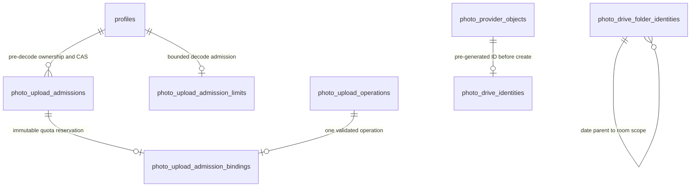

- 5개 새 private table은 RLS/no direct grants다. 기존 #83 public primitive의 service EXECUTE를 회수하고
  admission-bound wrapper와 service-only private provider/read context만 연다. 내부 locator context를 HTTP DTO로 전달하지 않는다.
- admission은 현재 actor/session/capability·attempt/assignment/slot/photo CAS를 검증한 뒤 본문 decoding 전에
  307,200 bytes를 예약한다. 같은 scoped digest는 같은 reservation이며, 호출마다 actor 30/min 포화 counter를 소비한다.
  미연결 admission 5분·slot 1/actor 8 in-flight는 CPU/용량 기술 상한이고 2h/24h 제품 capability와 별개다.
- singleton quota는 `about.storageQuota.usage` 전체 계정 사용량, refresh 요청 시작 시각과 revision을 보존한다.
  60초 이상 지난/unknown snapshot은 차단한다. 시작 순서가 뒤집힌 응답은 최신 projection을 덮지 못한다.
  전체 사용량 + 미반영 pending bytes가 decimal 10,000,000,000 이상이면 경고, 12,000,000,000 이상이면 신규 업로드 차단이다.
- accepted도 refresh 시작 **이전** Google 생성 시각과 DB의 최초 provider-success 관측 event가 모두 확인되어
  관측 usage에 흡수되기 전에는 예약 용량을 유지한다. 응답 유실 뒤 늦게 기록된 성공은 오래된 quota snapshot에서 차감하지 않는다.
  timeout/unknown/lease 만료로 공간을 반환하지 않는다. 미연결 admission 만료는 외부 호출이 불가능했던 경우만 해제하며,
  verified compensation 완료는 삭제 증거로 해제한다. 따라서 accepted 직후 quota snapshot 갱신 전 undercount가 없다.
- Drive `files.generateIds` 결과와 검증된 부모 folder ID는 object/operation에 불변 연결하고 파일 ID 전역 unique를 강제한다.
  날짜·객실 폴더도 private registry의 `(upload_date, scope_room_number)` unique로 후보 ID를 create 전에 예약한다.
  date scope는 빈 객실 키와 root parent, room scope는 같은 날짜 date winner를 FK·검증으로 연결한다.
  서로 다른 worker/candidate는 동일 winner만 받아 사용하며 losing ID는 Drive create에 사용하지 않는다.
  파일 identity는 해당 날짜·객실 registry winner에만 연결한다. registry UPDATE/DELETE와 Data API 직접 접근은 금지한다.
  ID 예약은 uploaded 상태가 아니다. 실제 provider 최초 `createdTime`을 `uploaded_at`으로 기록하고 409/retry에도 시각을 교체하지 않는다.
  예약한 `upload_date`와 실제 `createdTime`의 KST 날짜가 다르면 finalize를 거부한다. 자정 교차로 생긴 known candidate는
  불변 ID·폴더·시각을 유지한 채 fenced reconciliation/compensation으로만 종료하며 사진 acceptance를 만들지 않는다.
- 사진 read는 app photo ID를 입력해 accepted·verified·미만료·미삭제를 검사한다. exact active business admin 또는
  현재 통보된 assignment/attempt를 소유한 active maid만 허용하며, old revision/interrupted/upload-only read는 차단한다.
  current pointer clear/replace는 미만료 accepted 과거 사진 version 자체를 삭제하지 않는다. auth session도 매 요청 다시 검사한다.

### #83 개발 소스: 사진 업로드 작업·provider identity

`20260908170714_photo_storage_operations.sql`은 기존 30개 migration 뒤의 개발 전용 변경이다.
실제 Drive HTTP/OAuth, 업로드·열람 route, 7일 purge worker와 production 적용을 포함하지 않는다.

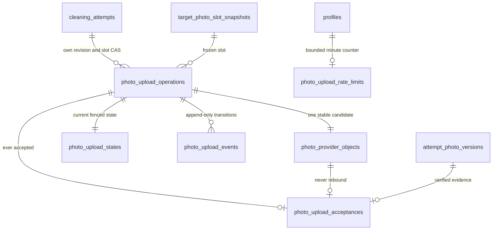

- private/RLS/no direct grants. 좁은 service-only RPC가 actor/session/capability와 버전을 재검증한다.
- operation의 `(actor,photo.upload,key digest)` unique와 별도 canonical request hash는 불변이며 원문 key를 보존하지 않는다.
- provider locator는 private 객체 row에만 존재하고 provider 전체 unique다. operation당 candidate는 하나이며 claim마다 복제하지 않는다.
- 성공 clock/metadata는 write-once다. `purge_after = uploaded_at + 168h`; retry나 재제출이 만료를 연장하지 않는다.
- acceptance는 current pointer와 다른 불변 이력이다. 인계/교체/clear/계정폐기로 accepted를 compensation 대상으로 재분류하지 않는다.
- finalization과 reconciliation은 같은 domain/state/object lock으로 직렬화한다. unknown은 삭제 불가,
  never-accepted known candidate를 terminal compensation fence로 닫은 경우에만 삭제 후보로 반환한다.
- claim digest와 monotonic fence를 함께 확인한다. slot provider-call in-flight 1 / actor 같은 in-flight 8 / 신규 작업 30/min /
  lease 5분·최대8회는 기술 상한이며 2h/24h 사용자 capability와 별개다. raw claim/session은 공개 projection에 없다.
- `photo.upload_accepted` audit는 photo/attempt/target/slot ID와 version/시각만 allowlist projection한다.
  외부 실패나 DB 응답 유실을 audit 성공으로 위장하지 않으며 물리 완료/제출/검수/수익 상태를 변경하지 않는다.

### #7C 개발 소스: Offline v1 lease / quarantine

`20260908144558_attempt_offline_lease_quarantine.sql`은 기존 28개 migration 뒤에
추가하는 개발 schema이며 운영/recovery 적용이나 Cron 활성화를 의미하지 않는다.

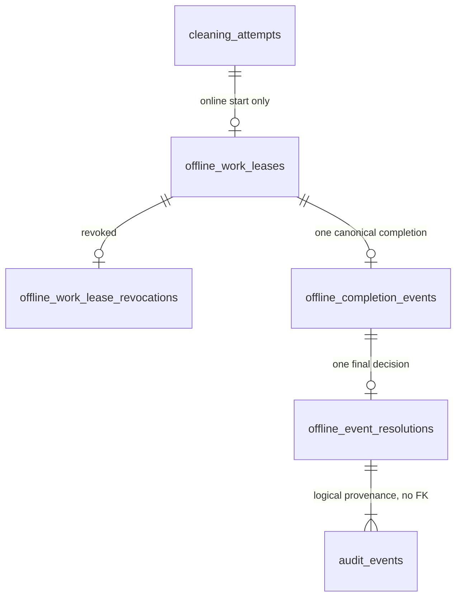

- 네 raw table은 모두 private/RLS/no direct grants다. 고정 search_path의 service-only
  RPC가 최신 Auth session·actor·ownership·CAS를 검사한다. session UUID는 저장하지 않는다.
- work lease는 온라인 `start-with-lease`와 원자 발급한다. 기존 PIN lease/limited capability와
  별개이며 `attempt_id` UNIQUE로 request key를 바꿔도 TTL을 연장하지 않는다.
- 실행 lease는 `[issued_at, issued_at+2h)`이고 모든 metadata/replay 최종선은 서버가 정한
  `issued_at+90d`다. 늦은 접수·다른 UUID·관리자 결정으로 보존 기간을 연장하지 않는다.
- `offline_completion_events`의 `(actor_profile_id,event_id)` UNIQUE와 `lease_id` UNIQUE가
  중복 적용 및 UUID 교체 공격을 막는다. unknown/다른 소유자 lease는 원장 없이 거절한다.
- 정상 completion만 검증된 normalized 시각으로 물리 완료와 audit를 원자 기록한다.
  known expired/revoked 또는 clock/KST 충돌은 quarantine하며 재전송으로 자동 승격하지 않는다.
- 관리자는 `record_only` / `reject_effect` / `correction_link` 중 최종 결정을 한 번 기록한다.
  correction은 현재 동일 담당·current notified assignment·in_progress·CAS·source identity와
  검증 가능한 원 normalized 시각을 다시 확인한다. 자유 `correctedAt`이나 종료/인계 회차 복구는 없다.
  검수/room-ready/submission/earning은 생성하지 않는다.
- 이벤트 원 UUID/client 시각/offset/hash/응답은 영구 command receipt나 audit에 복제하지 않는다.
  별도 audit에는 서버 생성 quarantine ID와 고정 resolution만 남겨 보정 provenance를 유지한다.
  위 audit 연결은 실제 FK가 아닌 논리 provenance다. 모든 resolution은 결정 audit 하나를 만들고,
  correction은 별도의 `cleaning.field_completed` 업무 audit도 같은 transaction에 추가한다.
- bounded purger는 만료 lease 최대 100건의 종속 metadata 묶음만 FK 순서로 정리한다.
  일반 원장/audit에는 DELETE가 없고 unexpired metadata 삭제도 차단한다. purge 뒤 과거 lease는
  unknown reject, 이미 시작된 attempt의 새 lease 발급도 금지라 이벤트를 다시 실행할 수 없다.

### #7B 개발 소스: 중단·인계와 제한 권한

`20260908123214_attempt_handover_limited_capability.sql`은 기존 27개 migration을
수정하지 않는 후속 schema다. 운영/recovery 적용을 의미하지 않는다.

- `profiles.account_lifecycle_version`: 역할/상태 변경 CAS. trigger가 증가시키며 일반 로그인 권한을 확장하지 않는다.
- `private.attempt_capability_grants`: profile/attempt/assignment revision/action/발급·만료 시각을 고정한다.
  `(attempt_id, kind)` UNIQUE로 같은 업무에 다른 명령 키를 써도 2시간/24시간을 연장하지 못한다.
- `private.attempt_capability_revocations`: 완료·인계·계정 변경에 따른 영구 회수 원장. UPDATE/DELETE 금지.
- `private.attempt_handover_events`: 같은 target의 old interrupted → new scheduled 관계를 보존한다.
  이전 담당/시작/증빙 snapshot은 수정하지 않으며, 승인된 인계 이력만 current-work 판단에서 제외한다.
  실제 후속 회차와 원장 없는 interrupted는 계속 차단한다.
- 한 건 마무리는 `deactivation_pending` + `finish_current(2h)`이고, 실제 완료는
  `field_completed` + `upload_only` + `upload_submit(24h)`로 원자 전환한다.
- 일반 인계는 이전 메이드 계정을 active로 유지한다. 명시적인 비활성화 선택 또는 기존 pending일 때만
  upload_only로 전환한다. 이전 interrupted 회차에는 `evidence_upload(24h)`만 있어 전체 제출 권한은 없다.
- 원장은 private/RLS/no direct grants이며 service-owned RPC만 사용한다. Auth session ID는 검증 인자로만
  사용하고 원장·감사·receipt·응답에 저장하지 않는다. 제한 경로도 최신 역할/상태·session·ownership·만료를 재검증한다.
- 만료된 미착수 scheduled는 관리자 명령에서만 superseded 보존 후 다음날 재계획한다.
  source 검증 실패는 전체 rollback이며 reclean 원담당 불변, NULL due 보존, 실제 점유와 다음 입실 경계를 유지한다.
- 사진 실업로드/제출·offline lease/PIN은 여기서 구현하지 않는다. capability 권한 계약과 실제 구현을 구분한다.

1. 계정 수명주기 마이그레이션과 관리자 API를 적용한다.
2. 근무 가능일 3개 테이블과 current pointer, 원자 command, RLS를 `dev` 통합 범위로 적용한다. (Issue #6)
3. 사진 manifest JSON을 슬롯·사진 테이블로 정규화한다.
4. 지급 명령에서 `payroll_items` 잠금 합계와 cycle 상태를 원자적으로 전이한다.
5. 도메인별 서버 명령과 상태 전이 테스트를 추가한다.
